# SECTION 03 - 데이터 가공을 위한 SQL

<br>

<br>

<br>

## 5강 - 하나의 값 조작하기

<br>

수집한 데이터의 일부는 원래 분석 용도가 아니어서 분석에 활용하기 어려운 경우가 있습니다.

이러한 경우 데이터를 가공해서 분석하기 쉽게 유지해두는 편이 좋은데요, 지금부터 데이터를 분석에 적합한 형태로 가공하는 방법을 소개하겠습니다.

<br>

**데이터를 가공해야하는 이유**

- 다룰 데이터가 데이터 분석 용도로 상정되지 않아서
- 연산할 때 비교 가능한 상태로 만들고 오류를 회피하기 위해서

<br>

<br>

<br>

###  [ 1 ] 코드 값을 레이블로 변경하기

<br>

코드 값을 그대로 레포트로 출력하면 사람들이 이해하기 힘듭니다. 이러한 코드값들을 미리 레이블로 변경해보겠습니다.

<br>

테스트 테이블 - **mst_users**

<br>

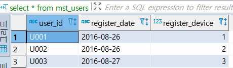 

<br>

register_device 1 ==> 데스크톱
register_device 2 ==> 스마트폰
register_device 3 ==> 애플리케이션  

로 레이블화하겠습니다.

<br>

```sql
select
	user_id
	, case
		when register_device = 1 then '데스크톱'
		when register_device = 2 then '스마트폰'
		when register_device = 3 then '애플리케이션'
	  end as device_name
from mst_users;
```

<br>

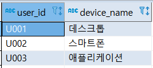 

<br>

<br>

<br>

###  [ 2 ] URL에서 요소 출력하기

<br>

분석 현장에서는 서비스 런칭  때에 로그 조건과 분석 요건을 제대로 검토하지 못하고, 일단 최소한의 요건으로
래퍼러와 페이지 URL을 저장하는 경우가 있습니다. 그리고 이후에 저장한 URL을 기반으로 요소들을 추출합니다.

<br>

여기서는 다음과 같은 샘플 데이터 (데이터 5-2)를 사용해 URL과 관련된 조작을 해봅시다.

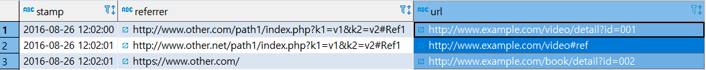

<br>

<br>

#### 래퍼러로 어떤 웹 페이지를 거쳐 넘어왔는지 판별하기

<br>어떤 웹 페이지를 거쳐 넘어왔는지 판별할 때는 래퍼러를 집계합니다. 하지만 이를 [데이터 5-2] 처럼 페이지 
단위로 집계하면 밀도가 너무 작아 복잡해지므로, 호스트 단위로 집계하는 것이 일반적입니다. 

Hive나 BigQuery에서는 URL을 다루는 함수가 있습니다. 하지만 지금 사용하는 PostgreSql에서는 없으므로
정규 표현식으로 호스트 이름의 패턴을 추출해야 합니다.

아래와 같이 쿼리를 짜보고 실행한 결과를 보겠습니다.

<br>

```sql
-- 코드 5-2
select
	stamp
	, substring(referrer from 'https?://([^/]*)') as reffer_host
from access_log;
```

<br>

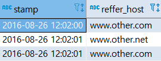 

<br>

<br>

URL 에서 경로와 요청 매개변수 값 추출하기

<br>

상품과 관련된 리포트를 작성할 때, 어떤 상품이 열람되는지 특정하는 ID를 데이터로 따로 저장해두지 않는 경우가 있을 수 있습니다. 
그래도 URL을 로그 데이터로 저장해두었다면 URL 경로를 가공해서 상품 리포트를 생성이 가능합니다.

<br>

다음 코드에는 URL 경로와 GET 요청 매개변수에 있는 특정 키를 추출하는 쿼리입니다.

<br>

```sql
-- 코드 5-3
select
	stamp
	, url
	, substring(url from '//[^/]+([^?#]+)') as path
	, substring(url from 'id=([^&]*)') as id
from 
	access_log al;
```

<br>

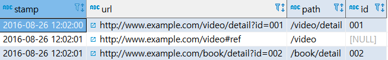 

<br>

<br>

<br>

###  [ 3 ] 문자열을 배열로 분해하기

<br>

빅데이터 분석에서 가장 많이 사용되는 자료형은 문자열이지만, 문자열 자료형은 범용적인 자료형이므로 더 세부적으로 분해해서 사용해야 하는 경우가 많습니다.

예를 들어 영어 문장을 공백으로 분할해서 하나한의 단어로 구분하는 경우처럼 말이죠.

접근 로그 샘플을 기반으로 페이지 계층을 나누어 봅시다.

<br>

```sql
-- 코드 5-4 URL 경로를 슬래시로 분할해서 계층을 추출하는 쿼리
select
	stamp
	, url
	, split_part(substring(url from '//[^/]+([^?#]+)' ), '/',2) as path1
	, split_part(substring(url from '//[^/]+([^?#]+)' ), '/',3) as path2
from access_log al;
```

<br>

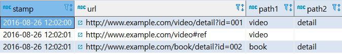 

<br>

<br>

###  [ 4 ] 날짜와 타임스탬프 다루기

<br>

로그 데이터를  처리할 때는 날짜 또는 타임 스탬프 등의 시간 정보가 굉장히 많이 사용됩니다.
하지만 미들웨어에 따라서 시간 정보를 다루는 자료형 또는 함수에 큰 차이가 있습니다.
지금부터 날짜와 타임스탬프를 다룰 때 사용하는 방법을 알아보겠습니다.

<br>

#### 현재 날짜와 타임스탬프 추출하기

<br>

PostgreSQL 의 경우에는 CURRENT_TIMESTAMP 의 리턴 값으로 타임존이 적용된 타임스탬프 자료형이 나옵니다.
하지만 이 이외의 미들웨어는 타임존 없는 타임스탬프를 리턴합니다.  만약 타임존을 적용하고 싶지 않으면 LOCALTIMESTAMP 를 사용하면 됩니다. 
( 참고: [타임존이란?](https://ratseno.tistory.com/11) )

<br>

```sql
-- 코드 5-5 현재 날짜와 타임스탬프를 추출하는 쿼리
select 
	current_date as dt
	, current_timestamp as stamp
	, localtimestamp as stamp_with_local
;
```

<br>

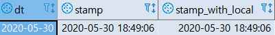 

<br>

<br>

#### 지정한 값의 날짜/시각 데이터 추출하기

<br>

현재 시각이 아니라 문자열로 지정한 날짜와 시각을 기반으로 날짜와 타임 스탬프 자료형의 데이터를 만들어야 하는 경우도 있습니다.
다음 코드에서는 가장 범용적인 CAST 함수를 사용하는 방법을 사용해보겠습니다.

<br>

```sql
-- 코드 5-6 문자열을 날짜 자료형, 타임스탬프 자료형으로 변환하는 쿼리
select
	cast('2016-01-30' as date) as dt
	, cast('2016-01-30 12:00:00' as timestamp) as stamp
	-- PostgreSQL, RedShift 의 경우 'value::type' 사용도 가능, value에는 컬럼이름도 가능
	, '2020-01-30'::date as dt_2
	, '2020-01-30'::timestamp as stamp_2
```

<br>

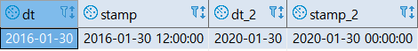 

<br>

<br>

#### 날짜/시각에서 특정 필드 추출하기

<br>

타임스탬프 자료형의 데이터에서 년과 월 등의 특정 필드값을 추출할 때는 EXTRACT 함수를 사용합니다.
EXTRACT 함수를 지원하지 않는 HIVE와 SparkSQL은 각각의 필드를 추출하는 별도의 함수가 제공됩니다.

<br>

**코드 5-7**  <span style="color:red;font-weight:bold">타임스탬프 자료형</span>의 데이터에서 연, 월, 일 등을 추출하는 쿼리

```sql
select 
	stamp
	, extract(year from stamp) as year
	, extract(month from stamp) as month
	, extract(day from stamp) as day
	, extract(hour from stamp) as hour
from 
	(select cast('2020-05-30 12:00:00' as timestamp) as stamp) as t;
```

<br>

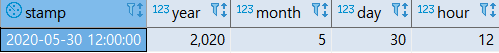 

<br>
<br>

이번에는 substring 함수를 사용해 문자열을 추출하는 쿼리를 사용해서 연, 월,일 ,시를 분리해봅시다.

<br>

**코드 5-8**  타임스탬프를 나타내는 <span style="color:red;font-weight:bold">문자열</span>에서 연, 월, 일, 시를 분리하기

```sql
select 
	stamp
	, substring(stamp, 1, 4) as year
	, substring(stamp, 6, 2) as month
	, substring(stamp, 9, 2) as day
	, substring(stamp, 12, 2) as hour
from
	(select cast('2020-05-30 12:00:00' as text) as stamp) as t;
```

<br>

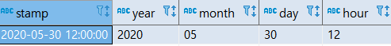 

<br>

<br>

<br>

### [ 5 ] 결손 값을 디폴트 값으로 대치하기

<br>

문자열 또는 숫자를 다룰 때는 중간에 NULL이 들어있는 경우를 주의해야 합니다.
<span style="color:red;font-weight:bold">NULL과 문자열을 결합하면 NULL 이 되며, NULL 과 숫자를 사칙 연산해도 NULL 이 됩니다</span>.
데이터가 우리가 원하는 형태가 아니면, 이것을 다시 원하는 형태로 가공해야 합니다.
<br>

구매액과 NULL을 포함하는 쿠폰 금액이 저장된 테이블이 있을 때, 
다음 코드는 쿠폰으로 할인했을 때의 매출 금액을 구하는 쿼리입니다.

<br>

데이터 5-3 쿠폰 사용 여부가 함께 있는 구매 로그 테이블(purchase_log_with_coupon)

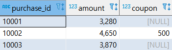 


<br>

**코드 5-9**  구매액에서 할인 쿠폰 값을 제외한 매출 금액을 구하는 쿼리

```sql
select
	purchase_id
	, amount
	, coupon
	, amount - coupon as discount_amount1
	, amount - coalesce(coupon,0) as discount_amount2
from 
	purchase_log_with_coupon;
```

<br>

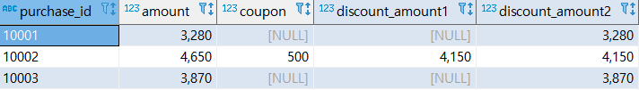 

<br>

<br>

<br>

<br>

## 6강 - 여러 개의 값에 대한 조작

<br>

데이터 분석시 여러 값을 집약해서 하나의 값으로 만들거나, 다양한 값을 비교하는 경우가 많습니다.

이런 경우가 언제인지, 그리고 어떻게 할지를 알아봅시다.

<br>

<br>

**새로운 지표 정의하기**

<br>

어떤 페이지가 출력된 횟수를 페이지 뷰,  어떤 페이지를 추력한 사용자 수를 방문자 수라고 정의할 수 있습니다.
<br>이 두개의 데이터를 사용해서  `<페이지 뷰>  /  <방문자 수>`  를 구하면 
 [ 사용자 한 명이 페이지를 몇 번이나 방문했는가? ] 라는 새로운 지표를 계산할 수 있습니다.
<br>또한 웹사이트에서는 방문한 사용자 수 중에서 특정한 행동(클릭 또는 구매 등)을 실행한 사용자의 비율을 구해 CTR(클릭 비율: Click Through Rate) ,
 CVR(컨버전 비율: Conversion Rate) 이라고 부르는 지표를 정의하고 활용하는 경우가 많습니다.

<br>

단순하게 숫자로 비교하면 숫자가 큰 데이터만 주목하게 되지만, '개인별'  또는 '비율' 등의 지표를 사용하면 다양한 관점에서 데이터를 바라볼 수 있습니다.

<br>

<br>
<br>

### [ 1 ]  문자열 연결하기

<br>

리포트를 작성할 때는 용도에 맞게 여러 개의 데이터를 연결해서 다루기 쉬운 형식으로 만드는 경우가 많습니다.

<br>

여기서는 우리나라의 주소를 이어 붙이는 코드를 작성해보겠습니다.

<br>

**데이터 6-1**  사용자의 주소 정보(mst_user_location) 테이블

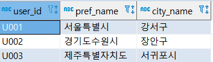 

<br>

<br>

**코드 6-1**  문자열을 연결하는 쿼리

```sql
select
	user_id
	, concat(pref_name,city_name) as pref_city_1
	, pref_name || city_name as pref_city_2
from 
	mst_user_location mul;
```

<br>

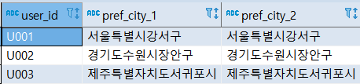 

<br>

<br>

<br>

### [ 2 ]  여러 개의 값 비교하기

<br>

다음 데이터는 4분기 매출(quarterly_sales)을 나타내는 테이블입니다.
<br>

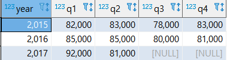 

<br>

위 테이블을 여러가지 예를 들어서 사용해보겠습니다.

<br>

<br>

<br>

#### 분기별 매출 증감 판정하기

<br>

일단 분기별로 매출이 증가했는지, 감소했는지를 판정해보겠습니다. 
<br>

<br>

**코드 6-2**   q1, q2 컬럼을 비교하는 쿼리

```sql
select 
	year
	, q1
	, q2
	, case
		when q1 < q2 then '+'
		when q1 = q2 then ' '
		else '-'
	  end as judge_q1_q2
	, q2 - q1 as diff_q2_q1
	, sign(q2 - q1) as sign_q2_q1
from 
	quarterly_sales
order by
	year;
```

<br>

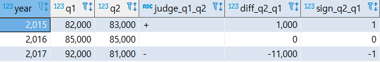 

<br>

위의 방식이라면   q2와 q3 ,  q3와 a4 도 비교할 수 있습니다.

다만 작년의 q4와 q1을 비교할 때는 이 방법을 사용할 수 없습니다. 여러 레코드에 걸쳐있는 값을 비교하려면 여러 개의 레코드를 조합해야 합니다. 이 방법은 7장에서 배우겠습니다.

<br>

<br>

<br>

#### 연간 최대/최소 4분기 매출 찾기

<br>

방금까지는 2개의 컬럼을 대소 비교했는데, 이번에는 3개 이상의 컬럼을 비교할 때 방금 같은 방식으로 하면 아무래도 코드가 복잡해지겠죠?

<br>

컬럼 값에서 최댓값 또는 최솟값을 찾을 때는 greatest 함수,  least  함수를 사용합니다. ( greatest 함수,  least  함수는 SQL 표준에 없지만 대부분의 SQL 쿼리 엔진에 구현되어 있습니다)

<br>

**코드 6-3**  연간 최대/최수 4분기 매출을 찾는 쿼리

```sql
select 
	year
	, greatest(q1,q2,q3,q4) as greatest_sales
	, least(q1,q2,q3,q4) as least_sales
from 
	quarterly_sales
order by
	year;
```

<br>

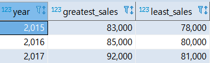 

<br>

<br>

<br>

#### 연간 평균 4분기 매출 계산하기

<br>

함수를 사용해서 여러개의 컬럼 값을 처리하는 경우를  "평균 4분기 매출 계산하기" 를 통해서 알아보겠습니다.

<br>

**코드 6-4**  단순한 연산으로 4분기 매출을 구하는 쿼리

```sql
select
	year
	, (q1 + q2 + q3 + q4) / 4 as average
from
	quarterly_sales
order by
	year;
```

<br>

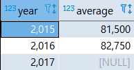 

<br>

NULL 값에 대한 처리가 안되었네요.
NULL 값을 사칙 연산하려면 앞서 사용했던 COALESCE 함수를 사용해 적절한 값으로 변환해야합니다.

<br>

<br>

<br>

**코드 6-5**  COALESCE를 사용해 NULL을 0으로 변환하고 평균값을 구하는 쿼리

```sql
select
	year
	, (  coalesce(q1,0) 
       + coalesce(q2,0) 
       + coalesce(q3,0) 
       + coalesce(q4,0) ) / 4 
		as average
from 
	quarterly_sales
order by
	year;
```

<br>

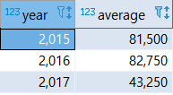 

<br>

위처럼 해서 NULL 값에 대한 처리는 됐지만, 2017년의 경우에는 q1, q2 에만 데이터가 있었는데, 그것을 4로 나누어서 다른 년도보다 평균 매출이 쭉 떨어진 값이 나옵니다. 이걸 SIGN을 통해서 고쳐 보겠습니다. 

<br>

<br>

**코드 6-6**   NULL이 아닌 컬럼만을 사용해서 평균값을 구하는 쿼리

```sql
select
	year
	, (coalesce(q1,0) + coalesce(q2,0) + coalesce(q3,0) + coalesce(q4,0) ) 
	/ (sign(coalesce(q1,0)) + sign(coalesce(q2,0)) + sign(coalesce(q3,0)) + sign(coalesce(q4,0)))
		as average
from 
	quarterly_sales
order by
```

<br>

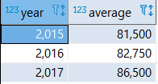 

<br>

<br>

<br>

### [ 3 ]  2개의 값 비율 계산하기

<br>

여기에서는 하나의 레코드에 포함된 값을 조합해서 비율을 계산하는 방법에 대해 알아보겠습니다.

다음은 광고 통계 정보(advertising_stats)를 나타내는 테이블입니다.

매일 광고 노출 수와 클릭 수를 집계합니다.

<br>

<br>

**데이터 6-3**  광고 통계 정보(advertising_stats) 테이블

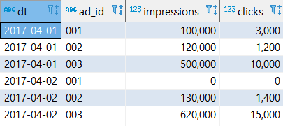 

(2017-04-02에서 연달아 0 이 나오는 것은, 해당 날에 광고를 내보내지 않아서 그런 것이다라고 생각하면 됩니다)

<br>

<br>

#### 정수 자료형의 데이터 나누기

<br>

위에서 본 데이터에서 각 광고의 CTR( = Click Through Rate) 을 계산해봅시다. **[ CTR = 클릭  /  노출 수 ]** 입니다.

<br>

아, 그런데 좀 주의할 부분이 있습니다. 오라클 같은 경우는 select 리스트에서 나누기 ("/") 를 하면 자동으로 부동소수 데이터가 되지만, PostgreSQL은 그렇지 않습니다. <br>

PostgreSQL은 정수 자료형을 정수 자료형으로 "/" 를 하면 똑같이 정수 자료형이 위의 CTR을 구하면 모든 값이 "0"이 될 겁니다. 
그렇기 때문에 CAST 함수를 사용해 clicks를 부동소수점 자료형으로 변환하고 계산해야 결과도 같은 자료형으로 나옵니다.

참고로 100.0 과 같은 숫자로 연산을 하면 CAST를 사용하지 않아도 부동소수점 자료형이 됩니다.

<br>

<br>

**코드 6-7**  정수 자료형의 데이터를 나누는 쿼리

```sql
select
	dt
	, ad_id
	, clicks / impressions as ctr
	, cast(clicks as double precision) / impressions as ctr2
	, 100.0 * clicks / impressions as ctr_as_percent
from
	advertising_stats 
where
	dt = '2017-04-01'
order by
	dt, ad_id;
```

<br>

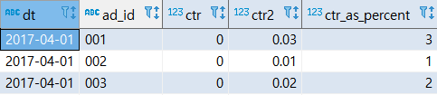 

<br>

<br>

#### 0으로 나누는 것 피하기

<br>

위에서는 특정한 날을 기준으로 계산했기에 값이 잘 나왔지만,  2017-04-02, ad_id = 001 값을 갖는 레코드에서는 impressions, clicks 값 모두 0 을 갖는데, 이렇다보니  위와 같은 연산을 하면 0으로 나누는 연산을 하게 됩니다.

당연히 에러가 납니다.

<br>

그렇다면 0으로 나누는 것을 피할 수 있는 방법은 뭐가 있을까요?

<br>

1\. CASE 문을 사용해서 impressions 의 값이 0인지 확인하는 방법입니다.
이 방법을 써서 연산을 할 때 , 0일 때는 NULL로 연산을 하도록 합니다.

<br>

이렇게 되면 NULL 전파에 의해서 어떤 연산을 하더라도 결과값이 NULL이 됩니다.
(이런 것을 **NULL 전파** 라고 합니다. NULL 전파란 NULL을 포함한 데이터의 연산 결과가 모두 NULL이 되는 SQL의 기본 성질입니다.)

<br>

2\. NULLIF(impressions,0)을 사용하는 것입니다. 앞의 NULLIF의 의미는  "impressions의 값이 0 이라면 NULL을 반환하라"는 뜻입니다.

<br>

<br>

**코드 6-8**  0으로 나누는 것을 피해 CTR을 계산하는 쿼리

```sql
select
	dt
	, ad_id
	, case
		when impressions > 0 then 100.0 * clicks / impressions
	  end as ctr_as_percent_by_case
	, 100.0 * clicks / nullif(impressions,0) as ctr_as_percent_by_null
from 
	advertising_stats
order by 
	dt, ad_id;
```

<br>

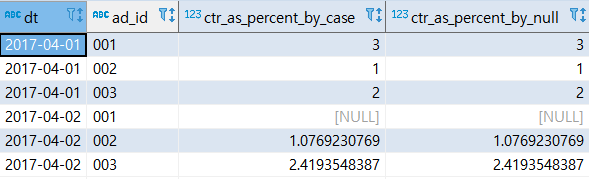 

<br>

<br>

<br>

### [ 4 ] 두 값의 거리 계산하기

<br>

별로 중요성을 못 느껴서 가볍게 테이블과 연산을 보고 넘어가겠습니다.

<br>

**데이터 6-5** 이차원 위치 정보(location_2d) 테이블

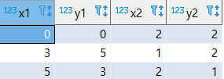 

<br>

<br>

**코드 6-10**  이차원 테이블에 대해 제곱 평균 제곱근(유클리드 거리)을 구하는 쿼리

```sql
select
	sqrt(power(x1 - x2,2) + power(y1 - y2,2)) as dist
	
	-- PostgreSQL에서 제공하는  point 자료형과 <-> 연산자를 쓰면 
	-- 위와 동일한 계산을 사용한다.
	, point(x1,y1) <-> point(x2,y2) as dist_2
from 
	location_2d;
```

<br>

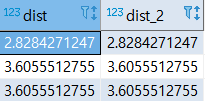 

<br>

<br>

<br>

### [ 5 ]  날짜/시간 계산하기

<br>

앞서 날짜 자료형과 타임 스탬프 자료형을 만드는 방법과 요소를 추출하는 방법을 알아봤는데, 

이번에는 두 날짜 데이터의 차이를 구하거나, 시간 데이터를 기준으로 1시간 후의 시간을 구하는 방법을 알아보겠습니다.

<br>

다음 테이블은 서비스 사용자의 등록 시간과 생일 정보를 포함하는 사용자 마스터 테이블입니다.

<br>

**데이터 6-6**  등록 시간과 생일을 포함하는 사용자 마스터(mst_users_with_dates) 테이블

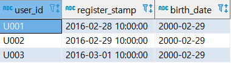 

<br>

이러한 샘플을 기반으로 회원 등록일 시점의 나이를 계싼하는 쿼리를 생각해봅시다.

나이는 시간의 경과에 따라서 변화하므로, 일반적으로 생년월일을 저장하고, 이후에 계산해서 나이를 구합니다.

<br>

기본적인 날짜/시간 데이터 계산 방법으로 정수의 덧셈과 뺄셈을 사용하는 방법을 살펴보겠습니다.

<br>

**코드 6-11**  미래 또는 과거의 날짜/시간을 계산하는 쿼리

```sql
select 
	user_id
	-- PostgreSQL 의 경우 interval 자료형의 데이터에 사칙 연산 적용
	, register_stamp::timestamp as register_stamp
	, register_stamp::timestamp + '1 hour'::interval as after_1_hour
	, register_stamp::timestamp - '30 minutes'::interval as before_30_minutes
	, register_stamp::date as register_date
	, (register_stamp::date + '1 day'::interval)::date as after_1_day
	, (register_stamp::date - '1 month'::interval)::date as before_1_month
from 
	mst_users_with_dates
;
```

<br>

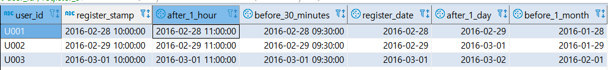 

<br>

<br>

<br>

#### 날짜 데이터들의 차이 계산하기

<br>

두 날짜 데이터를 사용해서 날짜의 차이를 계산하는 방법을 소개하겠습니다. 다음 코드 예는 회원 등록일과 현재 날짜의 차이, 그리고 회원 등록일과 생년월일과의 날짜 차이를 계싼하는 쿼리입니다.

<br>

**코드 6-12**  두 날짜의 차이를 계산하는 쿼리

```sql
select
	user_id
	, current_date as today
	, register_stamp::date as register_date
	, current_date - register_stamp::date as diff_days
from 
	mst_users_with_dates
;
```

<br>

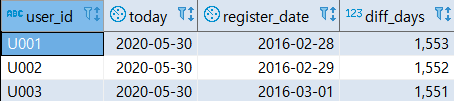 

<br>

<br>

#### 사용자의 생년월일로 나이 계산하기

<br>

나이를 계산하는 방법은 조금 복잡합니다. 윤년등을 고려해야되므로 단순하게 365일로 나누어 계산이 되는게 아니기 때문입니다.

나이를 계산하기 위한 전용 함수가 구현되어 있는 것은 PostgreSQL을 제외하고 많은 DBMS에서 구현되어 있지 않습니다. PostgreSQL에는 age라는 함수가 있습니다.

age 함수를 사용해 나이를 계산해 보겠습니다.  참고로 리턴값은 interval  자료형의 날짜 단위이므로, EXTRACT 함수로 연도(YEAR) 부분만 추출해야 합니다.

age 함수는 디폴트로 현재 나이를 리턴하지만, 특정 날짜를 지정하면, 해당 날짜에서의 나이를 리턴합니다.

(여기서 말하는 나이는 참고로 "만 나이" 입니다. 우리나라가 좀 특이하게 이걸 안 따르죠...)

<br>

**코드 6-13**  age 함수를 사용해 나이를 계산하는 쿼리

```sql
select
	user_id
	, current_date as today
	, register_stamp::date as register_date
	, birth_date::date as birth_date1
	, extract(year from age(birth_date::date)) as current_age
	, extract(year from age(register_stamp::date,birth_date::date)) as register_age
from 
	mst_users_with_dates
;
```

<br>

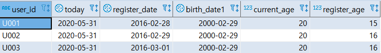 

<br>

<br>

age 함수같은 전용함수가 있다면 다행이지만, 없다면 어떻게 해야할까요?

그건 바로 날짜를 고정 자루 수의 정수로 표현하고, 그 차이를 계산하면 끝입니다.
예를 들어 다음 코드는 날짜를 정수로 표현해서 계산하는 쿼리입니다.

<br>

**코드 6-16** 등록 시점과 현재 시점의 나이를 문자열로 계산하는 쿼리

```sql
select
	user_id
	, substring(register_stamp,1,10) as register_date
	, birth_date
	-- 등록 시점의 나이 계산하기
	,floor(
		(  cast(replace(substring(register_stamp,1,10),'-','') as integer)
			- cast(replace(birth_date,'-','') as integer)
		) / 10000
	) as register_age
	-- 현재 시점의 나이 계산하기
	, floor(
		(  cast(replace(cast(current_date as text),'-','') as integer)
			- cast(replace(birth_date,'-','') as integer)
		) / 10000
	) as current_age
from 
	mst_users_with_dates
;
```

<br>

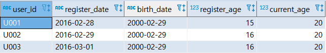 

<br>

<br>

<br>

### [ 6 ]  IP 주소 다루기

<br>

일반적인 웹 서비스는 로그 데이터에 사용자 IP 주소를 저장합니다.

보통 IP 주소를 로그로 저장할 때는 문자열로 저장합니다. 간단하게 IP 주소를 확인하거나 할 때는 문자열로 다루어도 충분하지만,
IP 주소를 서로 비교하거나 동일한 네트워크 IP 주소인지 판정할 때는 단순 문자열 비교로는 코드가 복잡해집니다.

<br>

여기서는 IP 주소를 비교하는 방법을 소개하겠습니다.

<br>

<br>

#### IP 주소 자료형 활용하기

PostgreSQL 에는 IP 주소를 다루기 위한 inet 자료형이 구현되어 있습니다.
이 자료형을 통해서 IP 주소를 쉽게 비교할 수 있습니다. 아래 예시를 코드를 실행해보겠습니다.

<br>

**코드 6-17**  inet 자료형을 사용한 IP 주소 비교 쿼리

```sql
select
	cast('127.0.0.1' as inet) < cast('127.0.0.2' as inet) as lt
	, cast('127.0.0.1' as inet) > cast('127.0.0.2' as inet) as gt
;
```

<br>

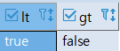 

<br>

<br>

추가로  address/y 형식의 네트워크 범위에 IP 주소가 포함되는지도 판정할 수 있다.

<br>

**코드 6-18**  inet 자료형을 사용해 IP 주소 범위를 다루는 쿼리

```sql
select cast('127.0.0.1' as inet) << cast('127.0.0.0/8' as inet) as is_contained;
```

<br>

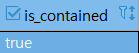 

<br>

<br>

#### 정수 또는 문자열로 IP 주소 다루기

그렇다면 inet 자료형을 제공하지 않는 미들웨어의 경우, IP 주소는 어떻게 비교할지 알아봐야겠죠?

<br>

##### 방법 1)  IP 주소를 정수 자료형으로 변환하기

첫 번째 방법은 IP  주소를 정수 자료형으로 변환하는 것입니다.
이렇게 하면 숫자 대소 비교 등이 가능해집니다. 아래의 코드는 텍스트 자료형으로 정의된 IP를 4개의 10진수로 부분적으로 잘라내서 추출합니다.

<br>

**코드 6-19**  IP 주소에서 4개의 10진수 부분을 추출하는 쿼리

```sql
select 
	ip
	, cast(split_part(ip,'.',1) as integer) as ip_part_1
	, cast(split_part(ip,'.',2) as integer) as ip_part_2
	, cast(split_part(ip,'.',3) as integer) as ip_part_3
	, cast(split_part(ip,'.',4) as integer) as ip_part_4
from 
--	(select '192.168.0.1' as ip) as t
	(select cast('192.168.0.1' as text) as ip) as t;
;
```

<br>

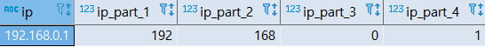 

<br>

<br>

앞에서 추출한 4개의 10진수 부분을 가각 2^24, 2^16, 2^8, 2^0 만큼 곱하고 더하면 정수 자료형 표기가 됩니다.

이러면 대소 비교 혹은 범위 판정 등을 할 수 있습니다.

<br>

**코드 6-20**  IP 주소를 정수 자료형 표기로 변환하는 쿼리

```sql
select
	ip
	, cast(split_part(ip,'.',1) as integer) * 2^24 
	+ cast(split_part(ip,'.',2) as integer) * 2^16 
	+ cast(split_part(ip,'.',3) as integer) * 2^8 
	+ cast(split_part(ip,'.',4) as integer) * 2^0
	as ip_integer
from 
--	(select '192.168.0.1' as ip) as t
	(select cast('192.168.0.1' as text) as ip) as t
;
```

<br>

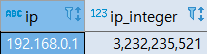 

<br>

<br>

##### 방법 2)  IP 주소를 0으로 메우기

IP의 각 10 진수 부분을 3 자리 숫자가 되게 앞 부분을 0으로 메워서 문자열로 만들면, IP 주소들간의 비교가 가능해집니다.

<br>

**코드 6-12**  IP 주소를 0으로 메운 문자열로 변환하는 쿼리

```sql
select 
	ip
	,  lpad(split_part(ip,'.',1),3,'0') 
	|| lpad(split_part(ip,'.',2),3,'0')
	|| lpad(split_part(ip,'.',3),3,'0')
	|| lpad(split_part(ip,'.',4),3,'0')
	as ip_padding
from 
--	(select '192.168.0.1' as ip) as t
	(select cast('192.168.0.1' as text) as ip) as t
;
```

<br>

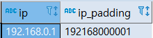 

<br>

<br>

7강은 "SECTION_03_(2).md" 에서 계속 진행하겠습니다.


