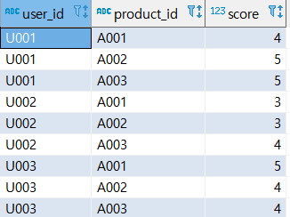

## 7강 - 하나의 테이블에 대한 조작

<br>

이번 장에서는 데이터 집약과 데이터 가공을 테마로, 하나의 테이블을 대상으로 하는 데이터 집약 방법과 가공 방법을 알아보겠습니다.

<br>

<br>

**데이터 집약**

SQL은 집약 함수라고 부르는 여러가지 함수를 제공합니다. 이를 통해 합계, 평균, 최댓값,최솟값 등을 손쉽게 알아 낼 수 있습니다. 그리고 SQL:2003 에서 도입된 윈도 함수(분석 함수)를 사용하면 집약 함수만으로 하기 힘든 일도 해낼 수 있습니다.

<br>

앞으로 전반적으로 데이터의 합계와 평균을 구하는 일이 많을  테니, 이번 7강에서는 데이터 집약과 관련된 기본적인 내용을 살펴보겠습니다.

<br>

<br>

**데이터 가공**

앞의 5,6 장에서는 하나의 값에 대한 데이터 가공이었지만, 이번에는 테이블을 기반으로 데이터를 처리하는 방법을 알아보겠습니다.

이때 만약 테이블이 집계하기 적절하지 않으면, 어떻게 대응할지에 대해서도 알아보겠습니다.

<br>

<br>

<br>

<br>

### [ 1 ]  그룹의 특징 잡기

<br>

집약 함수란 여러 레코드를 기반 **하나**의 값을 리턴하는 함수입니다. ex) COUNT, SUM 등
다음 데이터 예는 상품 평가(review) 테이블인데, 상품에 대한 사용자 평가 및 점수가 저장되어 있습니다.
이 테이블에 SUM과 AVG를 사용해보겠습니다.

<br>

**데이터 7-1**  상품 평가(review) 테이블

 

<br>

<br>

<br>

#### 테이블 전체의 특징량 계산하기

집약 함수인 SUM, COUNT, AVG, MAX, MIN  을 사용해서 특징량을 계산하겠습니다.

<br>

**코드 7-1**  집약 함수를 사용해서 특징량 뽑아내기

```sql
select
 	count(*) as total_count
 	, count(distinct user_id) as user_count
 	, count(distinct product_id) as product_count
 	, sum(score) as sum
 	, avg(score) as avg
 	, max(score) as max
 	, min(score) as min
from 
	review r
;
```

<br>

| total_count | user_count | product_count | sum  | avg                | max  | min  |
| ----------- | ---------- | ------------- | ---- | ------------------ | ---- | ---- |
| 9           | 3          | 3             | 37.0 | 4.1111111111111111 | 5.0  | 3.0  |

<br>

<br>

<br>

#### 그루핑한 데이터의 특징량 계산하기

데이터를 조금 더 작게 분할하고 싶다면 GROUP BY 구문을 사용해 데이터를 분류할 키를 지정하고, 그러한 키를 기반으로 데이터를 집약합니다.  
다음 코드는 3명의 user_id 기반으로 그룹을 묶고, 각각의 데이터 집합에 집약 함수를 적용합니다.

<br>

**코드 7-2**  사용자 기반으로 데이터를 분할하고 집약 함수를 적용하는 쿼리

```sql
select
  user_id
  , count(*) as total_count
  , count(distinct product_id) as product_count
  , sum(score) as sum
  , avg(score) as avg
  , max(score) as max
  , min(score) as min
from 
  review
group by
  user_id
;
```

<br>

| user_id | total_count | product_count | sum  | avg                | max  | min  |
| ------- | ----------- | ------------- | ---- | ------------------ | ---- | ---- |
| U001    | 3           | 3             | 14.0 | 4.6666666666666667 | 5.0  | 4.0  |
| U002    | 3           | 3             | 10.0 | 3.3333333333333333 | 4.0  | 3.0  |
| U003    | 3           | 3             | 13.0 | 4.3333333333333333 | 5.0  | 4.0  |

<br>

이때 주의할 것이 있습니다. group by 구문을 사용한 쿼리에서는, group by 구문에 지정한 컬럼 또는 집약 함수만
 SELECT 구문의 컬럼으로 지정할 수 있습니다.

<span style="color:red;font-weight:bold">group by 구문을 사용한 쿼리에서는 group by 구문에 지정한 컬럼을 유니크 키로 새로운 테이블을 만들게 됩니다</span>. 
이 과정에서느 <span style="color:red;font-weight:bold">group by 구문에 지정하지 않은 컬럼은 사라져 버립니다</span>. 

즉, <span style="color:red;font-weight:bold">집약 함수를 적용한 값과 집약 전의 값은 동시에 사용할 수 없는 것</span>입니다.

<br>

<br>

<br>

#### 집약 함수를 적용한 값과 집약 전의 값을 동시에 다루기

SQL : 2003 이후에 정의된 윈도 함수가 지원되는 DBMS 라면,  윈도 함수를 사용해서 쉽고 효율적으로 집약 함수의 결과와 원래 값을 조합할 수 있습니다. 

다음 코드에서는 개별 리뷰 점수(avg_score) 와 사용자 평균 리뷰 점수(user_avg_score) 의 차이를 구하는 예입니다.

<br>

**코드 7-3**  윈도 함수를 사용해 집약 함수의 결과와 원래 값을 동시에 다루는 쿼리

```sql
select
  user_id
  , product_id
  , score
  , avg(score) over() as avg_score
  , avg(score) over(partition by user_id) as user_avg_score
  , score - avg(score) over(partition by user_id) as user_avg_score_diff
from
  review
;
```

<br>

| user_id | product_id | score | avg_score          | user_avg_score     | user_avg_score_diff |
| ------- | ---------- | ----- | ------------------ | ------------------ | ------------------- |
| U001    | A001       | 4.0   | 4.1111111111111111 | 4.6666666666666667 | -0.6666666666666667 |
| U001    | A002       | 5.0   | 4.1111111111111111 | 4.6666666666666667 | 0.3333333333333333  |
| U001    | A003       | 5.0   | 4.1111111111111111 | 4.6666666666666667 | 0.3333333333333333  |
| U002    | A001       | 3.0   | 4.1111111111111111 | 3.3333333333333333 | -0.3333333333333333 |
| U002    | A002       | 3.0   | 4.1111111111111111 | 3.3333333333333333 | -0.3333333333333333 |
| U002    | A003       | 4.0   | 4.1111111111111111 | 3.3333333333333333 | 0.6666666666666667  |
| U003    | A001       | 5.0   | 4.1111111111111111 | 4.3333333333333333 | 0.6666666666666667  |
| U003    | A002       | 4.0   | 4.1111111111111111 | 4.3333333333333333 | -0.3333333333333333 |
| U003    | A003       | 4.0   | 4.1111111111111111 | 4.3333333333333333 | -0.3333333333333333 |

<br>

<span style="color:red;font-weight:bold">집약 함수로 윈도 함수를 사용하려면, 집약 함수 뒤에 OVER 구문을 붙이고 여기에 윈도 함수를 지정</span>합니다.
OVER 구문에 매개 변수를 지정하지 않으면 테이블 전체에 집약 함수를 적용합니다.
<br>
매개 변수에 PARTITION BY \<컬럼 이름> 을 지정하면 해당 컬럼 값을 기반으로 그룹화하고 집약 함수를 적용합니다. 참고로 <span style="color:red;font-weight:bold">집약 함수의 결과와 원래 값을 조합해서 계산</span>하므로 score와 user_id들의 score 평균값 차이도 계산 할 수 있었습니다.
<br>

<br>

<br>

<br>

### [ 2 ]  그룹 내부의 순서

<br>

계속해서 윈도 함수를 활용해 데이터를 가공하는 방법을 소개하겠습니다.

SQL의 테이블은 기본적으로 **순서**라는 개념이 없습니다. 따라서 순위나, 시간에 따라 데이터를 다루려면 복잡한 쿼리가 필요했습니다. 하지만 윈도 함수가 등장하면서 SQL로 순서를 정하는 것은 아주 쉬운 일이 되었습니다.

인기 상품의 상품ID, 카테고리, 스코어 정보를 가진 인기 상품 테이블을 샘플로 SQL를 사용한 순위 작성, 순서를 고려한 계산 실행 방법등을 소개하겠습니다.

<br>

**데이터 7-2**  인기 상품(popular_products) 테이블
| product_id | category | score |
| ---------- | -------- | ----- |
| A001       | action   | 94    |
| A002       | action   | 81    |
| A003       | action   | 78    |
| A004       | action   | 64    |
| D001       | drama    | 90    |
| D002       | drama    | 82    |
| D003       | drama    | 78    |
| D004       | drama    | 58    |

<br>

<br>

<br>

#### ORDER BY 구문으로 순서 정의하기

윈도 함수로 순서를 다루는 기본적인 방법을 소개하겠습니다.

윈도 함수에서는 OVER 구문 내부에 ORDER BY 구문을 사용하여 순서를 정의할 수 있는데요, 
다음 코드 예제를 실행해서 눈으로 확인해보겠습니다.

<br>

**코드 7-4**  윈도 함수의 ORDER BY 구문을 사용해 테이블 내부의 순서를 다루는 쿼리

```sql
select
 product_id
 , score
 , row_number() over(order by score desc) as row
 , rank() over(order by score desc) as rank
 , dense_rank() over(order by score desc) as dense_rank
 -- 순서와는 관계 없지만 추가적으로 lag와 lead도 보여드리겠습니다.
 , lag(product_id) over(order by score desc) as lag1
 , lag(product_id,2) over(order by score desc) as lag2
 , lead(product_id) over(order by score desc) as lead1
 , lead(product_id,2) over(order by score desc) as lead2
from
 popular_products
order by
 row
;
```

<br>

| product_id | score | row  | rank | dense_rank | lag1 | lag2 | lead1 | lead2 |
| ---------- | ----- | ---- | ---- | ---------- | ---- | ---- | ----- | ----- |
| A001       | 94    | 1    | 1    | 1          |      |      | D001  | D002  |
| D001       | 90    | 2    | 2    | 2          | A001 |      | D002  | A002  |
| D002       | 82    | 3    | 3    | 3          | D001 | A001 | A002  | A003  |
| A002       | 81    | 4    | 4    | 4          | D002 | D001 | A003  | D003  |
| A003       | 78    | 5    | 5    | 5          | A002 | D002 | D003  | A004  |
| D003       | 78    | 6    | 5    | 5          | A003 | A002 | A004  | D004  |
| A004       | 64    | 7    | 7    | 6          | D003 | A003 | D004  |       |
| D004       | 58    | 8    | 8    | 7          | A004 | D003 |       |       |

<br>

<br>

<br>

#### ORDER BY 구문과 집약 함수 조합하기

ORDER BY 구문과 SUM/AVG 등의 집약 함수를 조합하면, 집약 함수의 적용 범위를 유연하게 지정할 수 있습니다.
다음 코드는 ORDER BY 구문과 집약 함수를 조합해서 계산하는 쿼리입니다. 참고로 ROWS 구문은 이후에 설명할 윈도 프레임 지정 구문입니다.

<br>

**코드 7-5**  ORDER BY 구문과 집약 함수를 조합해서 계산하는 쿼리

```sql
select
 product_id
 , score
 -- 점수 순서로 유일한 순위를 붙임
 , row_number() over(order by score desc) as row
 -- 순위 상위부터 누계 점수 계산하기
 , sum(score) 
     over(order by score desc
       rows between unbounded preceding and current row
   ) as cum_score
 -- 현재 행의 앞 뒤의 행이 가진 값을 기반으로 평균 점수 계산하기
 , avg(score) 
     over(order by score desc
 	   rows between 1 preceding and 1 following
   ) as local_avg
 -- 순위가 높은 상품 ID 추출하기
 , first_value(product_id) 
 	 over(order by score desc
 	   rows between unbounded preceding and unbounded following
   ) as first_value
 -- 순위가 낮은 상품 ID 추출하기
 , last_value(product_id) 
 	 over(order by score desc
 	   rows between unbounded preceding and unbounded following
   ) as last_value
from
 popular_products
order by 
 row
;
```

<br>

| product_id | score | row  | cum_score | local_avg           | first_value | last_value |
| ---------- | ----- | ---- | --------- | ------------------- | ----------- | ---------- |
| A001       | 94    | 1    | 94        | 92.0000000000000000 | A001        | D004       |
| D001       | 90    | 2    | 184       | 88.6666666666666667 | A001        | D004       |
| D002       | 82    | 3    | 266       | 84.3333333333333333 | A001        | D004       |
| A002       | 81    | 4    | 347       | 80.3333333333333333 | A001        | D004       |
| A003       | 78    | 5    | 425       | 79.0000000000000000 | A001        | D004       |
| D003       | 78    | 6    | 503       | 73.3333333333333333 | A001        | D004       |
| A004       | 64    | 7    | 567       | 66.6666666666666667 | A001        | D004       |
| D004       | 58    | 8    | 625       | 61.0000000000000000 | A001        | D004       |

<br>

cum_score 는 현재 행까지의 스코어를 모두 더한 값입니다.
local_avg 는 현재 행과 앞뒤의 행 하나씩, 전체 3개의 행의 평균 스코어를 계산한 값입니다.
first_value와 last_value 윈도 함수는 각각 윈도 내부의 가장 첫 번째 레코드와가장 마지막 레코드를 추출해주는 함수입니다.

<br>

<br>

<br>

#### 윈도 프레임 지정에 대해서

<span style="color:crimson;font-weight:bold">프레임 지정이란 현재 레코드 위치를 기반으로 상대적인 윈도를 정의하는 구문</span>입니다.
프레임 지정 구문에는 여러 종류가 있습니다.

가장 기본이 되는 것은 ROWS BETWEEN start AND end 입니다.
start와 end에는 'CURRENT ROW(현재 행)', 'n PRECEDING(n행 앞)', 'n FOLLOWING(n행 뒤)', 'UNBOUNDED PRECEDING(이전 행 전부)', 'UNBOUNDED FOLLOWING(이 행 전부)'  등의 키워드를 지정합니다.

<br>

앞의 코드 예에서 프레임 지정 범위를 쉽게 확인할 수 있게, 범위 내부의 상품 ID 를 집약하는 다음의 쿼리를 실행해봅니다.

<br>

**코드 7-6**  윈도 페리임 지정별 상품 ID를 집약하는 쿼리

```sql
select
  product_id
  , row_number() over(order by score desc) as row
  , array_agg(product_id) 
  	over(order by score desc 
  		rows between unbounded preceding and unbounded following
  	) as whole_agg
  , array_agg(product_id) over(order by score desc
  		rows between unbounded preceding and current row
  	) as cum_agg
  , array_agg(product_id) over(order by score desc 
  		rows between 1 preceding and 1 following
  	) as local_agg
from
 popular_products
where category = 'action'
order by row
;
```

<br>

| product_id | row  | whole_agg             | cum_agg               | local_agg        |
| ---------- | ---- | --------------------- | --------------------- | ---------------- |
| A001       | 1    | {A001,A002,A003,A004} | {A001}                | {A001,A002}      |
| A002       | 2    | {A001,A002,A003,A004} | {A001,A002}           | {A001,A002,A003} |
| A003       | 3    | {A001,A002,A003,A004} | {A001,A002,A003}      | {A002,A003,A004} |
| A004       | 4    | {A001,A002,A003,A004} | {A001,A002,A003,A004} | {A003,A004}      |

<br>

참고로 <span style="color:red;font-weight:bold">함수의 프레임 지정을 생략하고</span>  **order by 구문이 없는 경우 모든 행**,
<span style="color:red;font-weight:bold">함수의 프레임 지정을 생략하고 </span> **order by 구문이 있는 경우 첫 행에서 현재 행까지가 디폴트 프레임으로 지정**됩니다.

<br>

<br>

<br>

#### PARTITION BY 와 ORDER BY 조합하기

PARTITION BY 와 ORDER BY 조합해서 카테고리들의 순위를 계산하는 쿼리는 다음과 같습니다.

<br>

**코드 7-7**  윈도 함수를 사용해 카테고리들의 순위를 계산하는 쿼리

```sql
select
 category
 , product_id
 , score
 , row_number() over(partition by category order by score desc) as row
 , rank() over(partition by category order by score desc) as rank
 , dense_rank() over(partition by category order by score desc) as dense_rank
from
 popular_products
order by
 category, row
;
```

<br>

| category | product_id | score | row  | rank | dense_rank |
| -------- | ---------- | ----- | ---- | ---- | ---------- |
| action   | A001       | 94    | 1    | 1    | 1          |
| action   | A002       | 81    | 2    | 2    | 2          |
| action   | A003       | 78    | 3    | 3    | 3          |
| action   | A004       | 64    | 4    | 4    | 4          |
| drama    | D001       | 90    | 1    | 1    | 1          |
| drama    | D002       | 82    | 2    | 2    | 2          |
| drama    | D003       | 78    | 3    | 3    | 3          |
| drama    | D004       | 58    | 4    | 4    | 4          |

<br>

<br>


##### - 각 카테고리의 상위 n개 추출하기

카테 고리들의 순위를 계산했다면 각 카테고리 상위 n개를 추출하는 것도 간단합니다. 다만 SQL 의 사양으로
윈도 함수를 where 구문에 작성할 수 없으므로, SELECT 구문에서 윈도 함수를 사용한 결과를 서브 쿼리로 만들고
외부에서 WHERE 구문을 적용해야 합니다.   다음 코드는 카테고리들의 순위 상위 2개까지를 구하는 쿼리입니다.

<br>

**코드 7-8**  카테고리들의 순위 상위 2개까지의 상품을 추출하는 쿼리


```sql
select 
 *
from
 ( select
 	category
 	, product_id
 	, score
 	, row_number() 
 	 	over(partition by category order by score desc) 
 	  as rank
   from popular_products
 ) popular_products_with_rank
where rank <= 2
;
```

<br>

| category | product_id | score | rank |
| -------- | ---------- | ----- | ---- |
| action   | A001       | 94    | 1    |
| action   | A002       | 81    | 2    |
| drama    | D001       | 90    | 1    |
| drama    | D002       | 82    | 2    |

<br>

<br>

참고로 카테고리별 순위 순서에서 상위 1개의 상품 ID 를 추출할 경우 다음과 같이 FIRST_VALUE 윈도 함수를 사용하고 SELECT DISTINCT 구문으로 결과를 집약하는 방법도 있습니다.

<br>

**코드 7-9**  카테고리별 순위 최상위 상품을 추출하는 쿼리

```sql
select distinct
 category
 , first_value(product_id)
 	over(partition by category order by score desc 
 	  rows between unbounded preceding and unbounded following)
   as product_id
from
 popular_products
;
```

<br>

| category | product_id |
| -------- | ---------- |
| drama    | D001       |
| action   | A001       |

<br>

<br>

<br>

<br>

### [ 3 ]  세로 기반 데이터를 가로 기반으로 변환하기

<br>

SQL은 행(레코드) 기반으로 처리하는 것이 기본입니다. 따라서 데이터를 저장할 때는 최대한 데이터를 행으로 분할해서 저장하는 것이 좋습니다. 하지만 최종 출력에서는 데이터를 열로 전개해야 가독성이 높은 경우가 많습니다.
<br>

이번 절에서는 행 단위로 저장된 '세로 기반'을, 열 또는 쉼표로 구분된 문자열 등의 '가로 기반'으로 변환하는 방법을 설명하겠습니다.

<br>

<br>

#### 행을 열로 변환하기

SQL 에서 열은 '고정적'이어야 합니다.  따라서 열로 전개할 데이터의 '종류 및 수'를 미리 알고 있어야만 지금부터 설명하는 방법을 사용할 수 있습니다. 

<br>

다음과 같은 날짜별 KPI(?) 데이터를 갖는 테이블이 있다고 하겠습니다. 
날짜별로 "노출 수(impressions) ", "세션 수(session)", "사용자 수(user)"라는 3개의 지표를 지정합니다.

<br>

<br>

**데이터 7-3**  날짜별로 KPI 데이터(daily_kpi) 테이블

| dt         | indicator   | val  |
| ---------- | ----------- | ---- |
| 2017-01-01 | impressions | 1800 |
| 2017-01-01 | sessions    | 500  |
| 2017-01-01 | users       | 200  |
| 2017-01-02 | impressions | 2000 |
| 2017-01-02 | sessions    | 700  |
| 2017-01-02 | users       | 250  |

<br>

날짜별로 이러한 지표들의 추이를 쉽게 볼 수 있게, 열로 전개해봅시다.


p.106 이어서 작업하기