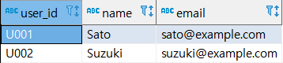
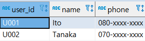
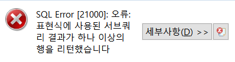

## 7강 - 하나의 테이블에 대한 조작

<br>

이번 장에서는 데이터 집약과 데이터 가공을 테마로, 하나의 테이블을 대상으로 하는 데이터 집약 방법과 가공 방법을 알아보겠습니다.

<br>

<br>

**데이터 집약**

SQL은 집약 함수라고 부르는 여러가지 함수를 제공합니다. 이를 통해 합계, 평균, 최댓값,최솟값 등을 손쉽게 알아 낼 수 있습니다. 그리고 SQL:2003 에서 도입된 윈도 함수(분석 함수)를 사용하면 집약 함수만으로 하기 힘든 일도 해낼 수 있습니다.

<br>

앞으로 전반적으로 데이터의 합계와 평균을 구하는 일이 많을  테니, 이번 7강에서는 데이터 집약과 관련된 기본적인 내용을 살펴보겠습니다.

<br>

<br>

**데이터 가공**

앞의 5,6 장에서는 하나의 값에 대한 데이터 가공이었지만, 이번에는 테이블을 기반으로 데이터를 처리하는 방법을 알아보겠습니다.

이때 만약 테이블이 집계하기 적절하지 않으면, 어떻게 대응할지에 대해서도 알아보겠습니다.

<br>

<br>

<br>

<br>

### [ 1 ]  그룹의 특징 잡기

<br>

집약 함수란 여러 레코드를 기반 **하나**의 값을 리턴하는 함수입니다. ex) COUNT, SUM 등
다음 데이터 예는 상품 평가(review) 테이블인데, 상품에 대한 사용자 평가 및 점수가 저장되어 있습니다.
이 테이블에 SUM과 AVG를 사용해보겠습니다.

<br>

**데이터 7-1**  상품 평가(review) 테이블

 

<br>

<br>

<br>

#### 테이블 전체의 특징량 계산하기

집약 함수인 SUM, COUNT, AVG, MAX, MIN  을 사용해서 특징량을 계산하겠습니다.

<br>

**코드 7-1**  집약 함수를 사용해서 특징량 뽑아내기

```sql
select
 	count(*) as total_count
 	, count(distinct user_id) as user_count
 	, count(distinct product_id) as product_count
 	, sum(score) as sum
 	, avg(score) as avg
 	, max(score) as max
 	, min(score) as min
from 
	review r
;
```

<br>

| total_count | user_count | product_count | sum  | avg                | max  | min  |
| ----------- | ---------- | ------------- | ---- | ------------------ | ---- | ---- |
| 9           | 3          | 3             | 37.0 | 4.1111111111111111 | 5.0  | 3.0  |

<br>

<br>

<br>

#### 그루핑한 데이터의 특징량 계산하기

데이터를 조금 더 작게 분할하고 싶다면 GROUP BY 구문을 사용해 데이터를 분류할 키를 지정하고, 그러한 키를 기반으로 데이터를 집약합니다.  
다음 코드는 3명의 user_id 기반으로 그룹을 묶고, 각각의 데이터 집합에 집약 함수를 적용합니다.

<br>

**코드 7-2**  사용자 기반으로 데이터를 분할하고 집약 함수를 적용하는 쿼리

```sql
select
  user_id
  , count(*) as total_count
  , count(distinct product_id) as product_count
  , sum(score) as sum
  , avg(score) as avg
  , max(score) as max
  , min(score) as min
from 
  review
group by
  user_id
;
```

<br>

| user_id | total_count | product_count | sum  | avg                | max  | min  |
| ------- | ----------- | ------------- | ---- | ------------------ | ---- | ---- |
| U001    | 3           | 3             | 14.0 | 4.6666666666666667 | 5.0  | 4.0  |
| U002    | 3           | 3             | 10.0 | 3.3333333333333333 | 4.0  | 3.0  |
| U003    | 3           | 3             | 13.0 | 4.3333333333333333 | 5.0  | 4.0  |

<br>

이때 주의할 것이 있습니다. group by 구문을 사용한 쿼리에서는, group by 구문에 지정한 컬럼 또는 집약 함수만
 SELECT 구문의 컬럼으로 지정할 수 있습니다.

<span style="color:red;font-weight:bold">group by 구문을 사용한 쿼리에서는 group by 구문에 지정한 컬럼을 유니크 키로 새로운 테이블을 만들게 됩니다</span>. 
이 과정에서느 <span style="color:red;font-weight:bold">group by 구문에 지정하지 않은 컬럼은 사라져 버립니다</span>. 

즉, <span style="color:red;font-weight:bold">집약 함수를 적용한 값과 집약 전의 값은 동시에 사용할 수 없는 것</span>입니다.

<br>

<br>

<br>

#### 집약 함수를 적용한 값과 집약 전의 값을 동시에 다루기

SQL : 2003 이후에 정의된 윈도 함수가 지원되는 DBMS 라면,  윈도 함수를 사용해서 쉽고 효율적으로 
집약 함수의 결과와 원래 값을 조합할 수 있습니다. 

다음 코드에서는 개별 리뷰 점수(avg_score) 와 사용자 평균 리뷰 점수(user_avg_score) 의 차이를 구하는 예입니다.

<br>

**코드 7-3**  윈도 함수를 사용해 집약 함수의 결과와 원래 값을 동시에 다루는 쿼리

```sql
select
  user_id
  , product_id
  , score
  , avg(score) over() as avg_score
  , avg(score) over(partition by user_id) as user_avg_score
  , score - avg(score) over(partition by user_id) as user_avg_score_diff
from
  review
;
```

<br>

| user_id | product_id | score | avg_score          | user_avg_score     | user_avg_score_diff |
| ------- | ---------- | ----- | ------------------ | ------------------ | ------------------- |
| U001    | A001       | 4.0   | 4.1111111111111111 | 4.6666666666666667 | -0.6666666666666667 |
| U001    | A002       | 5.0   | 4.1111111111111111 | 4.6666666666666667 | 0.3333333333333333  |
| U001    | A003       | 5.0   | 4.1111111111111111 | 4.6666666666666667 | 0.3333333333333333  |
| U002    | A001       | 3.0   | 4.1111111111111111 | 3.3333333333333333 | -0.3333333333333333 |
| U002    | A002       | 3.0   | 4.1111111111111111 | 3.3333333333333333 | -0.3333333333333333 |
| U002    | A003       | 4.0   | 4.1111111111111111 | 3.3333333333333333 | 0.6666666666666667  |
| U003    | A001       | 5.0   | 4.1111111111111111 | 4.3333333333333333 | 0.6666666666666667  |
| U003    | A002       | 4.0   | 4.1111111111111111 | 4.3333333333333333 | -0.3333333333333333 |
| U003    | A003       | 4.0   | 4.1111111111111111 | 4.3333333333333333 | -0.3333333333333333 |

<br>

<span style="color:red;font-weight:bold">집약 함수로 윈도 함수를 사용하려면, 집약 함수 뒤에 OVER 구문을 붙이고 여기에 윈도 함수를 지정</span>합니다.<br>
OVER 구문에 매개 변수를 지정하지 않으면 테이블 전체에 집약 함수를 적용합니다.
<br>
매개 변수에 PARTITION BY \<컬럼 이름> 을 지정하면 해당 컬럼 값을 기반으로 그룹화하고 집약 함수를 적용합니다. <br>참고로 <span style="color:red;font-weight:bold">집약 함수의 결과와 원래 값을 조합해서 계산</span>하므로 score와 user_id들의 score 평균값 차이도 계산 할 수 있었습니다.
<br>

<br>

<br>

<br>

### [ 2 ]  그룹 내부의 순서

<br>

계속해서 윈도 함수를 활용해 데이터를 가공하는 방법을 소개하겠습니다.

SQL의 테이블은 기본적으로 **순서**라는 개념이 없습니다. 따라서 순위나, 시간에 따라 데이터를 다루려면 복잡한 쿼리가 필요했습니다. 하지만 윈도 함수가 등장하면서 SQL로 순서를 정하는 것은 아주 쉬운 일이 되었습니다.

인기 상품의 상품ID, 카테고리, 스코어 정보를 가진 인기 상품 테이블을 샘플로 SQL를 사용한 순위 작성, 순서를 고려한 계산 실행 방법등을 소개하겠습니다.

<br>

**데이터 7-2**  인기 상품(popular_products) 테이블
| product_id | category | score |
| ---------- | -------- | ----- |
| A001       | action   | 94    |
| A002       | action   | 81    |
| A003       | action   | 78    |
| A004       | action   | 64    |
| D001       | drama    | 90    |
| D002       | drama    | 82    |
| D003       | drama    | 78    |
| D004       | drama    | 58    |

<br>

<br>

<br>

#### ORDER BY 구문으로 순서 정의하기

윈도 함수로 순서를 다루는 기본적인 방법을 소개하겠습니다.

윈도 함수에서는 OVER 구문 내부에 ORDER BY 구문을 사용하여 순서를 정의할 수 있는데요, 
다음 코드 예제를 실행해서 눈으로 확인해보겠습니다.

<br>

**코드 7-4**  윈도 함수의 ORDER BY 구문을 사용해 테이블 내부의 순서를 다루는 쿼리

```sql
select
 product_id
 , score
 , row_number() over(order by score desc) as row
 , rank() over(order by score desc) as rank
 , dense_rank() over(order by score desc) as dense_rank
 -- 순서와는 관계 없지만 추가적으로 lag와 lead도 보여드리겠습니다.
 , lag(product_id) over(order by score desc) as lag1
 , lag(product_id,2) over(order by score desc) as lag2
 , lead(product_id) over(order by score desc) as lead1
 , lead(product_id,2) over(order by score desc) as lead2
from
 popular_products
order by
 row
;
```

<br>

| product_id | score | row  | rank | dense_rank | lag1 | lag2 | lead1 | lead2 |
| ---------- | ----- | ---- | ---- | ---------- | ---- | ---- | ----- | ----- |
| A001       | 94    | 1    | 1    | 1          |      |      | D001  | D002  |
| D001       | 90    | 2    | 2    | 2          | A001 |      | D002  | A002  |
| D002       | 82    | 3    | 3    | 3          | D001 | A001 | A002  | A003  |
| A002       | 81    | 4    | 4    | 4          | D002 | D001 | A003  | D003  |
| A003       | 78    | 5    | 5    | 5          | A002 | D002 | D003  | A004  |
| D003       | 78    | 6    | 5    | 5          | A003 | A002 | A004  | D004  |
| A004       | 64    | 7    | 7    | 6          | D003 | A003 | D004  |       |
| D004       | 58    | 8    | 8    | 7          | A004 | D003 |       |       |

<br>

<br>

<br>

#### ORDER BY 구문과 집약 함수 조합하기

ORDER BY 구문과 SUM/AVG 등의 집약 함수를 조합하면, 집약 함수의 적용 범위를 유연하게 지정할 수 있습니다.
다음 코드는 ORDER BY 구문과 집약 함수를 조합해서 계산하는 쿼리입니다. 참고로 ROWS 구문은 이후에 설명할 윈도 프레임 지정 구문입니다.

<br>

**코드 7-5**  ORDER BY 구문과 집약 함수를 조합해서 계산하는 쿼리

```sql
select
 product_id
 , score
 -- 점수 순서로 유일한 순위를 붙임
 , row_number() over(order by score desc) as row
 -- 순위 상위부터 누계 점수 계산하기
 , sum(score) 
     over(order by score desc
       rows between unbounded preceding and current row
   ) as cum_score
 -- 현재 행의 앞 뒤의 행이 가진 값을 기반으로 평균 점수 계산하기
 , avg(score) 
     over(order by score desc
 	   rows between 1 preceding and 1 following
   ) as local_avg
 -- 순위가 높은 상품 ID 추출하기
 , first_value(product_id) 
 	 over(order by score desc
 	   rows between unbounded preceding and unbounded following
   ) as first_value
 -- 순위가 낮은 상품 ID 추출하기
 , last_value(product_id) 
 	 over(order by score desc
 	   rows between unbounded preceding and unbounded following
   ) as last_value
from
 popular_products
order by 
 row
;
```

<br>

| product_id | score | row  | cum_score | local_avg           | first_value | last_value |
| ---------- | ----- | ---- | --------- | ------------------- | ----------- | ---------- |
| A001       | 94    | 1    | 94        | 92.0000000000000000 | A001        | D004       |
| D001       | 90    | 2    | 184       | 88.6666666666666667 | A001        | D004       |
| D002       | 82    | 3    | 266       | 84.3333333333333333 | A001        | D004       |
| A002       | 81    | 4    | 347       | 80.3333333333333333 | A001        | D004       |
| A003       | 78    | 5    | 425       | 79.0000000000000000 | A001        | D004       |
| D003       | 78    | 6    | 503       | 73.3333333333333333 | A001        | D004       |
| A004       | 64    | 7    | 567       | 66.6666666666666667 | A001        | D004       |
| D004       | 58    | 8    | 625       | 61.0000000000000000 | A001        | D004       |

<br>

cum_score 는 현재 행까지의 스코어를 모두 더한 값입니다.
local_avg 는 현재 행과 앞뒤의 행 하나씩, 전체 3개의 행의 평균 스코어를 계산한 값입니다.
first_value와 last_value 윈도 함수는 각각 윈도 내부의 가장 첫 번째 레코드와가장 마지막 레코드를 추출해주는 함수입니다.

<br>

<br>

<br>

#### 윈도 프레임 지정에 대해서

<span style="color:crimson;font-weight:bold">프레임 지정이란 현재 레코드 위치를 기반으로 상대적인 윈도를 정의하는 구문</span>입니다.
프레임 지정 구문에는 여러 종류가 있습니다.

가장 기본이 되는 것은 ROWS BETWEEN start AND end 입니다.
start와 end에는 'CURRENT ROW(현재 행)', 'n PRECEDING(n행 앞)', 'n FOLLOWING(n행 뒤)', 'UNBOUNDED PRECEDING(이전 행 전부)', 'UNBOUNDED FOLLOWING(이 행 전부)'  등의 키워드를 지정합니다.

<br>

앞의 코드 예에서 프레임 지정 범위를 쉽게 확인할 수 있게, 범위 내부의 상품 ID 를 집약하는 다음의 쿼리를 실행해봅니다.

<br>

**코드 7-6**  윈도 페리임 지정별 상품 ID를 집약하는 쿼리

```sql
select
  product_id
  , row_number() over(order by score desc) as row
  , array_agg(product_id) 
  	over(order by score desc 
  		rows between unbounded preceding and unbounded following
  	) as whole_agg
  , array_agg(product_id) over(order by score desc
  		rows between unbounded preceding and current row
  	) as cum_agg
  , array_agg(product_id) over(order by score desc 
  		rows between 1 preceding and 1 following
  	) as local_agg
from
 popular_products
where category = 'action'
order by row
;
```

<br>

| product_id | row  | whole_agg             | cum_agg               | local_agg        |
| ---------- | ---- | --------------------- | --------------------- | ---------------- |
| A001       | 1    | {A001,A002,A003,A004} | {A001}                | {A001,A002}      |
| A002       | 2    | {A001,A002,A003,A004} | {A001,A002}           | {A001,A002,A003} |
| A003       | 3    | {A001,A002,A003,A004} | {A001,A002,A003}      | {A002,A003,A004} |
| A004       | 4    | {A001,A002,A003,A004} | {A001,A002,A003,A004} | {A003,A004}      |

<br>

참고로 <span style="color:red;font-weight:bold">함수의 프레임 지정을 생략하고</span>  **order by 구문이 없는 경우 모든 행**,
<span style="color:red;font-weight:bold">함수의 프레임 지정을 생략하고 </span> **order by 구문이 있는 경우 첫 행에서 현재 행까지가 디폴트 프레임으로 지정**됩니다.

<br>

<br>

<br>

#### PARTITION BY 와 ORDER BY 조합하기

PARTITION BY 와 ORDER BY 조합해서 카테고리들의 순위를 계산하는 쿼리는 다음과 같습니다.

<br>

**코드 7-7**  윈도 함수를 사용해 카테고리들의 순위를 계산하는 쿼리

```sql
select
 category
 , product_id
 , score
 , row_number() over(partition by category order by score desc) as row
 , rank() over(partition by category order by score desc) as rank
 , dense_rank() over(partition by category order by score desc) as dense_rank
from
 popular_products
order by
 category, row
;
```

<br>

| category | product_id | score | row  | rank | dense_rank |
| -------- | ---------- | ----- | ---- | ---- | ---------- |
| action   | A001       | 94    | 1    | 1    | 1          |
| action   | A002       | 81    | 2    | 2    | 2          |
| action   | A003       | 78    | 3    | 3    | 3          |
| action   | A004       | 64    | 4    | 4    | 4          |
| drama    | D001       | 90    | 1    | 1    | 1          |
| drama    | D002       | 82    | 2    | 2    | 2          |
| drama    | D003       | 78    | 3    | 3    | 3          |
| drama    | D004       | 58    | 4    | 4    | 4          |

<br>

<br>


##### - 각 카테고리의 상위 n개 추출하기

카테 고리들의 순위를 계산했다면 각 카테고리 상위 n개를 추출하는 것도 간단합니다. 다만 SQL 의 사양으로
윈도 함수를 where 구문에 작성할 수 없으므로, SELECT 구문에서 윈도 함수를 사용한 결과를 서브 쿼리로 만들고
외부에서 WHERE 구문을 적용해야 합니다.   다음 코드는 카테고리들의 순위 상위 2개까지를 구하는 쿼리입니다.

<br>

**코드 7-8**  카테고리들의 순위 상위 2개까지의 상품을 추출하는 쿼리


```sql
select 
 *
from
 ( select
 	category
 	, product_id
 	, score
 	, row_number() 
 	 	over(partition by category order by score desc) 
 	  as rank
   from popular_products
 ) popular_products_with_rank
where rank <= 2
;
```

<br>

| category | product_id | score | rank |
| -------- | ---------- | ----- | ---- |
| action   | A001       | 94    | 1    |
| action   | A002       | 81    | 2    |
| drama    | D001       | 90    | 1    |
| drama    | D002       | 82    | 2    |

<br>

<br>

참고로 카테고리별 순위 순서에서 상위 1개의 상품 ID 를 추출할 경우 다음과 같이 FIRST_VALUE 윈도 함수를 사용하고 SELECT DISTINCT 구문으로 결과를 집약하는 방법도 있습니다.

<br>

**코드 7-9**  카테고리별 순위 최상위 상품을 추출하는 쿼리

```sql
select distinct
 category
 , first_value(product_id)
 	over(partition by category order by score desc 
 	  rows between unbounded preceding and unbounded following)
   as product_id
from
 popular_products
;
```

<br>

| category | product_id |
| -------- | ---------- |
| drama    | D001       |
| action   | A001       |

<br>

<br>

<br>

<br>

<br>

### [ 3 ]  세로 기반 데이터를 가로 기반으로 변환하기

<br>

SQL은 행(레코드) 기반으로 처리하는 것이 기본입니다. 따라서 데이터를 저장할 때는 최대한 데이터를 행으로 분할해서 저장하는 것이 좋습니다. 하지만 최종 출력에서는 데이터를 열로 전개해야 가독성이 높은 경우가 많습니다.
<br>

이번 절에서는 행 단위로 저장된 '세로 기반'을, 열 또는 쉼표로 구분된 문자열 등의 '가로 기반'으로 변환하는 방법을 설명하겠습니다.

<br>

<br>

<br>

#### 행을 열로 변환하기

SQL 에서 열은 '고정적'이어야 합니다.  따라서 열로 전개할 데이터의 '종류 및 수'를 미리 알고 있어야만 지금부터 설명하는 방법을 사용할 수 있습니다. 

<br>

다음과 같은 날짜별 KPI(?) 데이터를 갖는 테이블이 있다고 하겠습니다. 
날짜별로 "노출 수(impressions) ", "세션 수(session)", "사용자 수(user)"라는 3개의 지표를 지정합니다.

<br>

<br>

**데이터 7-3**  날짜별로 KPI 데이터(daily_kpi) 테이블

| dt         | indicator   | val  |
| ---------- | ----------- | ---- |
| 2017-01-01 | impressions | 1800 |
| 2017-01-01 | sessions    | 500  |
| 2017-01-01 | users       | 200  |
| 2017-01-02 | impressions | 2000 |
| 2017-01-02 | sessions    | 700  |
| 2017-01-02 | users       | 250  |

<br>

날짜별로 이러한 지표들의 추이를 쉽게 볼 수 있게, 열로 전개해봅시다.

<br>

<br>

**코드 7-10**  행으로 저장된 지표 값을 열로 변환하기

```sql
select
 dt
 , max(case when indicator = 'impressions' then val end) as impressions
 , max(case when indicator = 'sessions' then val end) as sessions
 , max(case when indicator = 'users' then val end) as users
from
 daily_kpi
group by dt
order by dt
;
```


| dt         | impressions | sessions | users |
| ---------- | ----------- | -------- | ----- |
| 2017-01-01 | 1800        | 500      | 200   |
| 2017-01-02 | 2000        | 700      | 250   |

<br>

<br>

<br>

<br>

#### 행을 쉼표로 구분한 문자열로 집약하기

앞서 언급했던 것처럼 행을 열로 변환하는 방법은 미리 열의 종류와 수를 알고 있을 때만 사용할 수 있습니다.
따라서 열의 종류와 수를 모른다면 사용할 수 없죠.<br>

<br>

예를 들어 아래와 같은 상품 구매 상세 로그를 생각해봅시다. 한 번의 주문으로 여러 개의 상품을 구매했을 때,
이를 상품별로 레코드를 나누어 저장하는 테이블입니다.
구매 아이디로 집약하고 싶어도 상품을 몇개 샀는지 알 수 없기 때문에 전과 같은 방법은 사용할 수 없습니다.

<br>

<br>

**데이터 7- 4**  구매 상세 로그(purchase_detail_log) 테이블

| purchase_id | product_id | price |
| ----------- | ---------- | ----- |
| 100001      | A001       | 3000  |
| 100001      | A002       | 4000  |
| 100001      | A003       | 2000  |
| 100002      | D001       | 5000  |
| 100002      | D002       | 3000  |
| 100003      | A001       | 3000  |

<br>

<br>

<br>

미리 열의 수를 정할 수 없는 경우에는 데이터를 쉼표 등으로 구분한 문자열로 변환하는 방법을 생각해볼 수 있습니다.
다음 코드 예를 같이 실행해보겠습니다. 참고로 행을 문자열로 집약하는 함수는 미들웨어(DBMS) 마다 다릅니다.

<br>

<br>

**코드 7 - 11**  행을 집약해서 쉼표로 구분된 문자열로 변환하기

```sql
select
 purchase_id
 , string_agg(product_id,', ') as product_ids
 , sum(price) as amount
from purchase_detail_log
group by purchase_id
order by purchase_id
;
```

<br>

| purchase_id | product_ids      | amount |
| ----------- | ---------------- | ------ |
| 100001      | A001, A002, A003 | 9000   |
| 100002      | D001, D002       | 8000   |
| 100003      | A001             | 3000   |

<br>

<br>

<br>

<br>

<br>

### [ 4 ]  가로 기반 데이터를 세로 기반으로 변환하기

세로 기반 데이터를 가로 기반으로 변환해서 가공이 쉬운 데이터 형식으로 만드는 법을 알아보겠습니다.

<br>

<br>

#### 열로 표현된 값을 행으로 변환하기

<br>

**데이터 7 - 5**  4분기 매출(quarterly_sales) 테이블
| year | q1    | q2    | q3    | q4    |
| ---- | ----- | ----- | ----- | ----- |
| 2015 | 82000 | 83000 | 78000 | 83000 |
| 2016 | 85000 | 85000 | 80000 | 81000 |
| 2017 | 92000 | 81000 |       |       |

<br>

위 테이블을 연도,  4분기 레이블,  매출이라는 3개의 컬럼을 가진 테이블로 변환해보겠습니다.
현재 테이블을 보면 알겠지만, 하나의 레코드는 q1~q4 까지 모두 4개의 데이터로 구성됩니다. 

행으로 **전개할 데이터 수가 고정되어 있다면**, **그러한 데이터 수와 같은 수의 일련 번호를 가진 피벗 테이블을 만들고 CROSS JOIN 하면 됩니다**.

<br>

다음 코드를 실행해서 확인해보겠습니다.

<br>

**코드 7 - 12**  일련 번호를 가진 피벗 테이블을 사용해 행으로 변환하는 쿼리

```sql
select
 q.year
 -- Q1 ~ Q4 까지의 레이블 이름 출력하기
 ,case 
 	when p.idx = 1 then 'q1'
 	when p.idx = 2 then 'q2'
 	when p.idx = 3 then 'q3'
 	when p.idx = 4 then 'q4'
  end as quarter
 -- Q1 에서  Q4 까지의 매출 출력하기
 , case
 	when p.idx = 1 then q.q1
 	when p.idx = 2 then q.q2
 	when p.idx = 3 then q.q3
 	when p.idx = 4 then q.q4
  end as sales
from 
 quarterly_sales as q
 cross join
 -- 행으로 전개하고 싶은 열의 수만큼 순번 테이블 만들기
 (
 			  select 1 as idx
 	union all select 2 as idx
 	union all select 3 as idx
 	union all select 4 as idx
 ) as p
;
```

<br>

| year | quarter | sales  |
| ---- | ------- | ------ |
| 2015 | q1      | 82000  |
| 2015 | q2      | 83000  |
| 2015 | q3      | 78000  |
| 2015 | q4      | 83000  |
| 2016 | q1      | 85000  |
| 2016 | q2      | 85000  |
| 2016 | q3      | 80000  |
| 2016 | q4      | 81000  |
| 2017 | q1      | 92000  |
| 2017 | q2      | 81000  |
| 2017 | q3      | [NULL] |
| 2017 | q4      | [NULL] |

<br>

<br>

<br>

#### 임의의 길이를 가진 배열을 행으로 전개하기

<br>

고정 길이의 행으로 전개하는 것은 비교적 간단합니다. 하지만 길이가 확정되지 않으면 좀 복잡해집니다.

<br>

**데이터 7 - 6**  구매 로그(purchase_log) 테이블

```sql
DROP TABLE IF EXISTS purchase_log;
CREATE TABLE purchase_log (
    purchase_id integer
  , product_ids varchar(255)
);

INSERT INTO purchase_log
VALUES
    (100001, 'A001,A002,A003')
  , (100002, 'D001,D002')
  , (100003, 'A001')
;
```

<br>

| purchase_id | product_ids    |
| ----------- | -------------- |
| 100001      | A001,A002,A003 |
| 100002      | D001,D002      |
| 100003      | A001           |

<br>

위와 같은 테이블이 있고 상품 ID들을 레코드로 하나하나 전개하는 방법을 살펴보겠습니다.

<br>

만약 미들웨어가 테이블 함수를 구현하고 있다면, 배열을 쉽게 레코드로 전개할 수 있습니다. 이때 테이블 함수란
함수의 리턴값이 테이블인 함수를 의미합니다.

<br>

대표적인 테이블 함수로는 PostgreSQL과 BigQuery의 unnest 함수,  Hive와 SparkSQL의 explode 함수가 있습니다. unnest를 실행해보겠습니다.

<br>

**코드 7 - 13**   테이블 함수를 사용해 배열을 행으로 전개하는 쿼리

```sql
select unnest(array['A001','A002','A003']) as purchase_id;
```

<br>

| purchase_id |
| ----------- |
| A001        |
| A002        |
| A003        |

<br>

<br>

이러한 테이블 함수를 사용해서 방금 위에서 본 [ 데이터 7 - 6 ]의 구매 로그를 레코드로 전개해보겠습니다.

그런데 이때 주의할 점이 있는데,  일반적인 select 구문 내부에는 레코드에 포함된 스칼라 값을 리턴하는 함수와
컬럼 이름을 지정할 수 있지만, 테이블 함수는 **테이블**을 리턴합니다.

스칼라 값과 테이블 함수의 리턴 값을 동시에 추출하고 싶은 경우, 테이블 함수를 from 구문 내부에 작성하고
join 구문을 사용해 원래 테이블과 테이블 함수의 리턴 값을 결합해야합니다.

<br><br>

**코드 7 - 14**  테이블 함수를 사용해 쉼표로 구분된 문자열 데이터를 행으로 전개하는 쿼리

```sql
select
  purchase_id
  , product_id
from
  purchase_log as p
cross join 
  unnest(string_to_array(product_ids,',')) as product_id
;
```

<br>

| purchase_id | product_id |
| ----------- | ---------- |
| 100001      | A001       |
| 100001      | A002       |
| 100001      | A003       |
| 100002      | D001       |
| 100002      | D002       |
| 100003      | A001       |

<br>

<br>

<br>

참고로 PostgreSQL 의 경우 Select 구문 내부에 스칼라 값과 테이블 함수를 동시에 지정할 수 있습니다.

<br>

**코드 7 - 15**  PostgreSQL 에서 쉼표로 구분된 데이터를 행으로 전개하는 쿼리

```sql
select
  purchase_id
  , regexp_split_to_table(product_ids,',') as purchase_id
from
  purchase_log;
```

<br>

| purchase_id | purchase_id |
| ----------- | ----------- |
| 100001      | A001        |
| 100001      | A002        |
| 100001      | A003        |
| 100002      | D001        |
| 100002      | D002        |
| 100003      | A001        |

<br>

<br>

<br>

<br>

<br>

<br>

## 8강 여러 개의 테이블 조작하기

<br>

데이터 분석 실무에서는 여러 개의 테이블을 기반으로 데이터를 분석해야하는 경우가 많습니다.

따라서 어떤 경우에 어떤 이유로 여러 개의 테이블에 조작해야하는지 알아보겠습니다.

추가로 여러 개의 테이블을 조작할 때는 SQL이 복잡해지기 쉬운데, 이런 SQL을 간단하고 가독성 높게 작성하는

방법과 부족한 데이터를 보완하는 방법 등도 함께 소개하겠습니다.

<br>

<br>

<br>

### [ 1 ]  여러 개의 테이블을 세로로 결합하기

여러  테이블에 분산된 "비슷한 형식의 데이터"에 같은 처리를 해야 하는 경우가 있습니다.
이럴 때는 union all ,  union (distinct)  를 사용하면 되는데, 다음과 같은 예제 테이블이 있다고 가정하겠습니다.

<br>


데이터 8 - 1  애플리케이션1의 사용자 마스터 테이블 / 데이터 8 - 2 애플리케이션2의 사용자 마스터 테이블

  /    


두 테이블은 상당히 비슷한 구조이며,  이 두 테이블에 일괄적인 처리가 하고 싶으면, 다음 코드처럼 UNION ALL 구문을

사용해 여러 개의 테이블을 세로로 결합하면 좋습니다. 결합할 때는 테이블의 컬럼이 완전히 일치해야 하므로,

한쪽 테이블에만 존재하는 컬럼은 phone 컬럼처럼 select 구문으로 제외하거나, email 컬럼처럼 디폴트 값을 줘야 합니다.

<br>

<br>

**코드 8 - 1**  UNION ALL 구문을 사용해 테이블을 세로로 결합하는 쿼리

```sql
select 'app1' as app_name, user_id, name, email from app1_mst_users
union all
select 'app2' as app_name, user_id, name, null as email from app2_mst_users;
```

<br>

| app_name | user_id | name   | email              |
| -------- | ------- | ------ | ------------------ |
| app1     | U001    | Sato   | sato@example.com   |
| app1     | U002    | Suzuki | suzuki@example.com |
| app2     | U001    | Ito    |                    |
| app2     | U002    | Tanaka |                    |

<br>

<br>

<br>

<br>

### [ 2 ]  여러 개의 테이블을 가로로 정렬하기

하다보면 여러 개의 테이블을 가로로 붙이고 서로 데이터를 비교하거나 값을 조합하는 경우가 있습니다.

아래 3개의 예시 테이블을 통해서 그 작업을 해보겠습니다.

<br>

**데이터 8 - 3**  카테고리 마스터(mst_categories)

| category_id | name |
| ----------- | ---- |
| 1           | dvd  |
| 2           | cd   |
| 3           | book |

<br>

**데이터 8 - 4**  카테고리별 매출(category_sales) 테이블
| category_id | sales  |
| ----------- | ------ |
| 1           | 850000 |
| 2           | 500000 |

<br>

**데이터 8 - 5**  카테고리별 상품 매출 순위(product_sale_ranking) 테이블

| category_id | rank | product_id | sales |
| ----------- | ---- | ---------- | ----- |
| 1           | 1    | D001       | 50000 |
| 1           | 2    | D002       | 20000 |
| 1           | 3    | D003       | 10000 |
| 2           | 1    | C001       | 30000 |
| 2           | 2    | C002       | 20000 |
| 2           | 3    | C003       | 10000 |

<br>

<br>

주로 이런 테이블들을 조합하기 위해서는 JOIN을 사용합니다.

하지만 무조건 join을 하면 inner join을 사용하는 것이여서,  데이터가 출력이 안되거나, 중복되는 데이터가 출력될 수도 있습니다.

<br>

그러니 left outer join를 적절히 사용해야합니다. 아래와 같이 말이죠.

<br>

**코드 8 - 3**  마스터 테이블의 행 수를 변경하지 않고 여러 개의 테이블을 가로로 정렬하는 쿼리

```sql
select
	m.category_id
	, m."name"
	, s.sales
	, r.product_id as top_sale_product
from
	mst_categories as m
  left join
	category_sales as s
	on m.category_id = s.category_id
  left join
	product_sale_ranking as r
	on m.category_id = r.category_id
	and r.rank = 1
;
```

<br>

| category_id | name | sales  | top_sale_product |
| ----------- | ---- | ------ | ---------------- |
| 1           | dvd  | 850000 | D001             |
| 2           | cd   | 500000 | C001             |
| 3           | book |        |                  |

<br>

<br>

select 구문 내부에서 사관 서브 쿼리를 사용할 수 있는 미들웨어의 경우, JOIN을 사용하지 않고 여러 테이블 값을 가로로 정렬할 수 있습니다. 

다음 코드는 방금 위에서 join을 통해서 만든 결과물과 같습니다.

<br>

**코드 8 - 4**  상관 서브쿼리로 여러 개의 테이블을 가로로 정렬하는 쿼리

```sql
select
 m.category_id
 , m."name"
 -- 상관 서브 쿼리를 사용해 카테고리별로 매출액 추출하기
 , ( select s.sales
 	from category_sales as s
 	where m.category_id = s.category_id
 ) as sales
 -- 상관 서브쿼리를 사용해 카테고리별로 최고 매출 상품을
 -- 하나 추출하기(순위로 따로 압축하지 않아도 됨)
 , ( select r.product_id
 	 from product_sale_ranking as r
 	 where m.category_id = r.category_id
 	 order by sales desc
 	 limit 1
 ) as top_sale_product
from
 mst_categories as m
;
```

<br>

| category_id | name | sales  | top_sale_product |
| ----------- | ---- | ------ | ---------------- |
| 1           | dvd  | 850000 | D001             |
| 2           | cd   | 500000 | C001             |
| 3           | book |        |                  |

<br>

이렇게 서브 쿼리를 쓰면,  마스터 테이블의 로우의 갯수가 달라지는 것을 크게 신경 쓰지 않아도 된다. 
즉 테이블 조합 과정에서 데이터가 누락되거나 중복되는 사항이 발생하는 경우는 신경 쓰지 않아도 된다는 의미다.

그리고  [ 코드 8 - 2 ] 에서는 카테고리별 매출 테이블에 카테고리들의 순위(rank) 를 사전에 컬럼으로 저장했지만, 
상관 서브쿼리의 경우 내부에서 order by 구문과 limit 구문을 사용하면 사전 처리를 하지 않고도 데이터를 하나로 압축할 수 있다.

<br>

<br>

<br>

참고) 만약 위의 서브 상관 쿼리에서 억지로 2개의 결과를 내면?

```sql
 , ( select r.product_id
 	 from product_sale_ranking as r
 	 where m.category_id = r.category_id
 	 order by sales desc
 	 limit 2  -- 억지로 2개의 값을 뽑아냄
 ) as top_sale_product
```

<br>

에러 난다.

 

<br>

<br>

<br>

<br>

<br>

### [ 3 ]  조건 플래그를 0과 1로 표현하기

여기서는 이전에 설명한 여러 개의 테이블을 가로로 정렬하는 방법을 응용해서 마스터 테이블에 다양한 데이터를 집약하고,
마스터 테이블의 속성 조건을 0 또는 1 이라는 플래그로 표현하는 방법을 소개하겠습니다.

<br>

예를 들어 다음과 같이 신용카드 벊를 포함한 마스터 테이블( 데이터 8 - 6 ) 에 구매 로그 테이블 ( 데이터 8 - 7 )을 결합해서
사용자들의 '신용카드 번호 등록 여부', '구매 이력 여부'라는 두 가지 조건을 0과 1로 표현하는 방법을 알아보겠습니다.

<br>

<br>

**데이터 8 - 6**  신용카드 번호를 포함한 사용자 마스터(mst_users_with_card_number) 테이블
| user_id | card_number         |
| ------- | ------------------- |
| U001    | 1234-xxxx-xxxx-xxxx |
| U002    |                     |
| U003    | 5678-xxxx-xxxx-xxxx |

<br>

**데이터 8 - 7**  구매 로그(purchase_log) 테이블
| purchase_id | user_id | amount | stamp               |
| ----------- | ------- | ------ | ------------------- |
| 10001       | U001    | 200    | 2017-01-30 10:00:00 |
| 10002       | U001    | 500    | 2017-02-10 10:00:00 |
| 10003       | U001    | 200    | 2017-02-12 10:00:00 |
| 10004       | U002    | 800    | 2017-03-01 10:00:00 |
| 10005       | U002    | 400    | 2017-03-02 10:00:00 |

```sql
DROP TABLE IF EXISTS purchase_log;
CREATE TABLE purchase_log (
    purchase_id integer
  , user_id     varchar(255)
  , amount      integer
  , stamp       varchar(255)
);

INSERT INTO purchase_log
VALUES
    (10001, 'U001', 200, '2017-01-30 10:00:00')
  , (10002, 'U001', 500, '2017-02-10 10:00:00')
  , (10003, 'U001', 200, '2017-02-12 10:00:00')
  , (10004, 'U002', 800, '2017-03-01 10:00:00')
  , (10005, 'U002', 400, '2017-03-02 10:00:00')
;
```


<br>

<br>

사용자 마스터에 구매 로그를 결합할 때 LEFT JOIN 을 사용한 뒤 사용자 ID로 group by  하면, 
사용자 마스터의 레코드 수를 그대로 유지한 상태로 구매 로그 정보를 겨합할 수 있습니다.

이렇게 얻은 테이블을 기반으로 조건 플래그 0과 1을 줍니다.

이때 사용할 수 있는 방법은  **CASE** 와 **SIGN 함수** 입니다.

다음 코드를 실행해서  확인합니다.

<br>

<br>

과정 - 1 ( group by 하기 전 )

```sql
select 
	*
from 
	mst_users_with_card_number as m
  left join
  	purchase_log as p
  	on m.user_id = p.user_id 	
;
```

| user_id | card_number         | purchase_id | user_id | amount | stamp               |
| ------- | ------------------- | ----------- | ------- | ------ | ------------------- |
| U001    | 1234-xxxx-xxxx-xxxx | 10003       | U001    | 200    | 2017-02-12 10:00:00 |
| U001    | 1234-xxxx-xxxx-xxxx | 10002       | U001    | 500    | 2017-02-10 10:00:00 |
| U001    | 1234-xxxx-xxxx-xxxx | 10001       | U001    | 200    | 2017-01-30 10:00:00 |
| U002    |                     | 10005       | U002    | 400    | 2017-03-02 10:00:00 |
| U002    |                     | 10004       | U002    | 800    | 2017-03-01 10:00:00 |
| U003    | 5678-xxxx-xxxx-xxxx |             |         |        |                     |

<br>

과정 - 2 ( group by 후)

```sql
select
 	m.user_id
 	, m.card_number
 	, count(p.user_id) as purchase_count
	-- 신용 카드 번호를 등록한 경우 1, 등록하지 않은 경우 0으로 표현하기
 	, case when m.card_number is not null then 1 else 0 end as has_card
	-- 구매 이력이 있는 경우 1, 없는 경우 0으로 표현하기
 	, sign(count(p.user_id)) as has_purchased
from
	mst_users_with_card_number as m
 	left join
 	purchase_log as p
 	on m.user_id = p.user_id
group by m.user_id, m.card_number
order by user_id
;
```

| user_id | card_number         | purchase_count | has_card | has_purchased |
| ------- | ------------------- | -------------- | -------- | ------------- |
| U001    | 1234-xxxx-xxxx-xxxx | 3              | 1        | 1             |
| U002    |                     | 2              | 0        | 1             |
| U003    | 5678-xxxx-xxxx-xxxx | 0              | 1        | 0             |

<br>

<br>

<br>

<br>

<br>

### [ 4 ]  계산한 테이블에 이름 붙여 재사용하기

복잡한 처리를 하는 SQL 문을 작성할 때는 서브 쿼리의 중첩이 많아집니다. 비슷한 처리를 여러번 하는 경우도 있는데요. 

이렇게 되면 쿼리의 가독성이 굉장히 낮아집니다. 이때  SQL99 에서 도입된 공통 테이블 식 (CTE: Common Table Expression) 
을 사용하면 일시적인 테이블에 이름을 붙여 재사용할 수 있습니다. 그리고 이를 활용하면 코드의 가독성이 크게 높아집니다.

<br>

<br>

데이터 8 - 8  카테고리별 상품 매출(product_sales)  테이블
| category_name | product_id | sales |
| ------------- | ---------- | ----- |
| dvd           | D001       | 50000 |
| dvd           | D002       | 20000 |
| dvd           | D003       | 10000 |
| cd            | C001       | 30000 |
| cd            | C002       | 20000 |
| cd            | C003       | 10000 |
| book          | B001       | 20000 |
| book          | B002       | 15000 |
| book          | B003       | 10000 |
| book          | B004       | 5000  |

<br>

<br>

이번 절에는 위의 테이블을 통해서 카테고리별로 상품 순위를 한번에 볼 수 있는 형식으로 변환해보겠습니다.

<br>

**코드 8 - 6**  카테고리별 순위를 추가한 테이블에 이름 붙이기

```sql
with 
product_sale_ranking as (
  select
  	category_name
  	, product_id
  	, sales
  	, row_number() over(partition by category_name order by sales desc) as rank
  from
  	product_sales
) 
select * 
from product_sale_ranking;
```

<br>

| category_name | product_id | sales | rank |
| ------------- | ---------- | ----- | ---- |
| book          | B001       | 20000 | 1    |
| book          | B002       | 15000 | 2    |
| book          | B003       | 10000 | 3    |
| book          | B004       | 5000  | 4    |
| cd            | C001       | 30000 | 1    |
| cd            | C002       | 20000 | 2    |
| cd            | C003       | 10000 | 3    |
| dvd           | D001       | 50000 | 1    |
| dvd           | D002       | 20000 | 2    |
| dvd           | D003       | 10000 | 3    |

<br>

위에서 현재 CTE 구문을 사용해 만들어진 테이블에 product_sale_ranking 이라는 이름을 붙입니다. 
<span style="color:red;font-weight:bold">CTE 구문은 with 구문을 사용해 'WITH  \<테이블 이름>  AS  (SELECT ~)'  형태로 사용하는 구문</span>입니다.

<br>

<br>

카테고리들의 매출에 순위를 붙인 위의 product_sale_ranking 테이블이 만들어졌으면, 
테이블을 자기 결합해서 카테고리의 수만큼 넓게 펼칩니다. 다만 카테고리들에 포함된 상품의 수가 다르므로
, 최대 상품 수에 맞는 결과를 계싼할 수 있게 순위의 유니크한 목록을 계산해두겠습니다.

<br>

**코드 8 - 7**   카테고리들의 순위에서 유니크한 순위 목록을 계싼하는 쿼리

```sql
with 
product_sale_ranking as (
  select
  	category_name
  	, product_id
  	, sales
  	, row_number() over(partition by category_name order by sales desc) as rank
  from
  	product_sales
), mst_rank as (
  select distinct rank
  from product_sale_ranking psr
)
select * from mst_rank;
```

| rank |
| ---- |
| 4    |
| 2    |
| 3    |
| 1    |

<br>

<br>

위에서 구한 유니크한 순위를 기준으로 오른쪽으로 카테고리 순위를 쫙 펼쳐보겠습니다.

<br>

**코드 8 - 8**  카테고리들의 순위를 횡단적으로 출력하는 쿼리

```sql
with 
product_sale_ranking as (
  select
  	category_name
  	, product_id
  	, sales
  	, row_number() over(partition by category_name order by sales desc) as rank
  from
  	product_sales
)
, mst_rank as (
  select distinct rank
  from product_sale_ranking psr
)
select
  m.rank
  , r1.product_id	as dvd
  , r1.sales		as dvd_sales
  , r2.product_id	as cd
  , r2.sales		as cd_sales
  , r3.product_id	as book
  , r3.sales		as book_sales
from
	mst_rank as m
  left join
  	product_sale_ranking as r1
  	on m.rank = r1."rank"
  	and r1.category_name = 'dvd'
  left join
  	product_sale_ranking as r2
  	on m.rank = r2."rank"
  	and r2.category_name = 'cd'
  left join
  	product_sale_ranking as r3
  	on m.rank = r3.rank
  	and r3.category_name = 'book'
order by m.rank
;
```

| rank | dvd  | dvd_sales | cd   | cd_sales | book | book_sales |
| ---- | ---- | --------- | ---- | -------- | ---- | ---------- |
| 1    | D001 | 50000     | C001 | 30000    | B001 | 20000      |
| 2    | D002 | 20000     | C002 | 20000    | B002 | 15000      |
| 3    | D003 | 10000     | C003 | 10000    | B003 | 10000      |
| 4    |      |           |      |          | B004 | 5000       |

<br>

<br>

<br>

<br>

<br>

### [ 5 ]  유사 테이블 만들기

p.131 부터!


