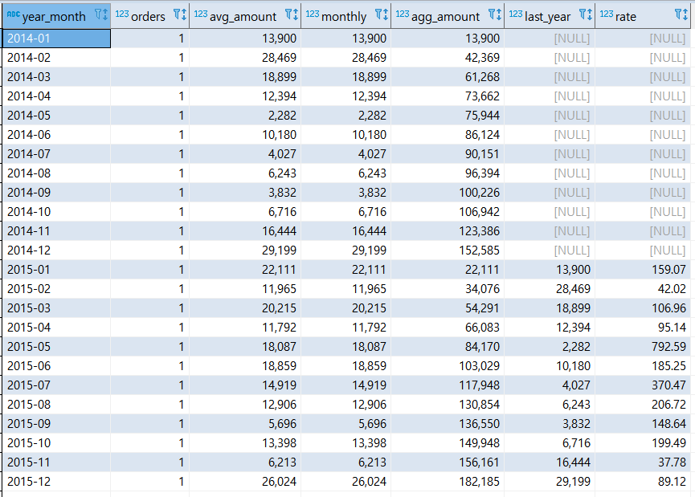
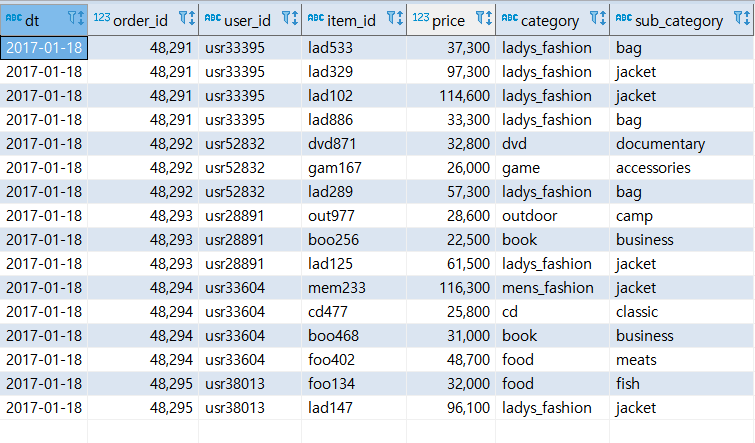
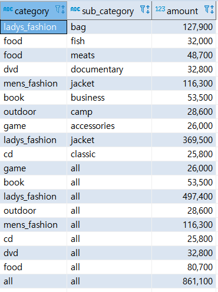
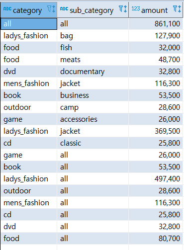
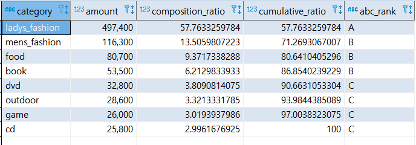

# SECTION 04 - 매출을 파악하기 위한 데이터 추출

<br>

<br>

<br>

<br>

## 9강 - 시계열 기반으로 데이터 집계하기

<br>

매일 매출을 단순하게 수치로만 확인하면 장기적인 관점에서 어떤 경향이 있는지 알 수 없습니다.<br>하지만 시계열로 매출 금액을 집계하면 어떤 규칙성을 찾을 수도 있으며, 어떤 기간과 비교했을 때 변화폭을 확인 할 수도 있습니다.

<br>

추가로 이번 9강에서는 데이터 집약 + 변화를 이해하기 쉽게 표현할 수 있는 리포팅 방법과 관련된 내용도 소개합니다.

<br>

<br>

<br>

**샘플 데이터**

2014~2015 년까지 2년에 걸친 매출 데이터를 샘플로 설명하겠습니다.

<br>

**데이터 9 - 1**  purchase_log 테이블
| dt         | order_id | user_id    | purchase_amount |
| ---------- | -------- | ---------- | --------------- |
| 2014-01-01 | 1        | rhwpvvitou | 13900           |
| 2014-01-01 | 2        | hqnwoamzic | 10616           |
| 2014-01-02 | 3        | tzlmqryunr | 21156           |
| 2014-01-02 | 4        | wkmqqwbyai | 14893           |
| 2014-01-03 | 5        | ciecbedwbq | 13054           |
| 2014-01-03 | 6        | svgnbqsagx | 24384           |
| 2014-01-03 | 7        | dfgqftdocu | 15591           |
| 2014-01-04 | 8        | sbgqlzkvyn | 3025            |
| 2014-01-04 | 9        | lbedmngbol | 24215           |
| 2014-01-04 | 10       | itlvssbsgx | 2059            |
| 2014-01-05 | 11       | jqcmmguhik | 4235            |
| 2014-01-05 | 12       | jgotcrfeyn | 28013           |
| 2014-01-05 | 13       | pgeojzoshx | 16008           |
| 2014-01-06 | 14       | msjberhxnx | 1980            |
| 2014-01-06 | 15       | tlhbolohte | 23494           |
| 2014-01-06 | 16       | gbchhkcotf | 3966            |
| 2014-01-07 | 17       | zfmbpvpzvu | 28159           |
| 2014-01-07 | 18       | yauwzpaxtx | 8715            |
| 2014-01-07 | 19       | uyqboqfgex | 10805           |
| 2014-01-08 | 20       | hiqdkrzcpq | 3462            |
| 2014-01-08 | 21       | zosbvlylpv | 13999           |
| 2014-01-08 | 22       | bwfbchzgnl | 2299            |
| 2014-01-09 | 23       | zzgauelgrt | 16475           |
| 2014-01-09 | 24       | qrzfcwecge | 6469            |
| 2014-01-10 | 25       | njbpsrvvcq | 16584           |
| 2014-01-10 | 26       | cyxfgumkst | 11339           |

<br>

<br>

<br>

<br>

### [ 1 ]  날짜별 매출 집계하기

매출을 집계하는 업무에서는 가로 축에 날짜, 세로 축에 금액을 표현하는 그래프를 사용합니다.<br> 날짜별로 매출을 집계하고, 동시에 평균 구매액을 집계하고, 다음 그림과 같은 리포트를 생성하는 SQL을 소개합니다.

<br>

**코드 9 - 1**  날짜별 매출과 평균 구매액을 집계하는 쿼리

```sql
select
   dt
  ,count(*) as purchase_count
  ,sum(purchase_amount) as total_amount
  ,avg(purchase_amount) as avg_amount
from purchase_log
group by dt
order by dt;
```

<br>

| dt         | purchase_count | total_amount | avg_amount             |
| ---------- | -------------- | ------------ | ---------------------- |
| 2014-01-01 | 2              | 24516        | 12258.0000000000000000 |
| 2014-01-02 | 2              | 36049        | 18024.500000000000     |
| 2014-01-03 | 3              | 53029        | 17676.333333333333     |
| 2014-01-04 | 3              | 29299        | 9766.3333333333333333  |
| 2014-01-05 | 3              | 48256        | 16085.333333333333     |
| 2014-01-06 | 3              | 29440        | 9813.3333333333333333  |
| 2014-01-07 | 3              | 47679        | 15893.000000000000     |
| 2014-01-08 | 3              | 19760        | 6586.6666666666666667  |
| 2014-01-09 | 2              | 22944        | 11472.0000000000000000 |
| 2014-01-10 | 2              | 27923        | 13961.5000000000000000 |

<br>

<br>

<br>

<br>

### [ 2 ]  이동평균을 사용한 날짜별 추이 보기

위처럼 나온 결과로 그래프를 그리면 매출이 상승하는 경향이 있는지,, 하락하는 경향이 있는지 판단하기 어려운데, 이러한 경우에는 7일 동안의 평균 매출을 사용한 '7일 이동 평균'으로 표현하는 것이 좋습니다.

<br>

코드 9 - 2  날짜별 매출과 7일 이동평균을 집계하는 쿼리

```sql
select 
  dt
  ,sum(purchase_amount) as total_amount
  ,avg(sum(purchase_amount)) over(order by dt rows between 6 preceding and current row)
   as seven_day_avg
  ,case
  	when
  	  7 = count(*)
  	  over(order by dt rows between 6 preceding and current row)
  	then 
  	  avg(sum(purchase_amount)) over(order by dt rows between 6 preceding and current row)
  	end 
  	as seven_day_avg_strict
from purchase_log
group by dt
order by dt
;
```

<br>

| dt         | total_amount | seven_day_avg      | seven_day_avg_strict |
| ---------- | ------------ | ------------------ | -------------------- |
| 2014-01-01 | 24516        | 24516.000000000000 |                      |
| 2014-01-02 | 36049        | 30282.500000000000 |                      |
| 2014-01-03 | 53029        | 37864.666666666667 |                      |
| 2014-01-04 | 29299        | 35723.250000000000 |                      |
| 2014-01-05 | 48256        | 38229.800000000000 |                      |
| 2014-01-06 | 29440        | 36764.833333333333 |                      |
| 2014-01-07 | 47679        | 38324.000000000000 | 38324.000000000000   |
| 2014-01-08 | 19760        | 37644.571428571429 | 37644.571428571429   |
| 2014-01-09 | 22944        | 35772.428571428571 | 35772.428571428571   |
| 2014-01-10 | 27923        | 32185.857142857143 | 32185.857142857143   |

<br>

참고로 코드 예의 seven_day_av 는 과거 7일분의 데이터를 추출할 수 없는 첫 번째 6일간에 대해 해당 6일만을 가지고 평균을 구하고 있습니다. 

만약 7일의 데이터가 모두 있는  경우에만 7일 이동평균을 구하고자 한다면, seven_day_avg_strict를 사용하기 바랍니다.

<br>

<br>

<br>

<br>

### [ 3 ]  당월 매출 누계 구하기

날짜별로 매출을 집계하고, 해당 월의 누계를 구하는 리포트를 만드는 방법에 대해 알아보겠습니다.

<br>

**코드 9 - 3**  날짜별 매출과 당월 누계 매출을 집계하는 쿼리

```sql
select
  dt
  -- 연-월 추출하기
  , substring(dt,1,7) as year_month
  , sum(purchase_amount) as total
  , sum(sum(purchase_amount))
  		over(partition by substring(dt,1,7) order by dt rows unbounded preceding)
  	as agg_amount
from purchase_log
group by dt
order by dt;
```

<br>

| dt         | year_month | total | agg_amount |
| ---------- | ---------- | ----- | ---------- |
| 2014-01-01 | 2014-01    | 24516 | 24516      |
| 2014-01-02 | 2014-01    | 36049 | 60565      |
| 2014-01-03 | 2014-01    | 53029 | 113594     |
| 2014-01-04 | 2014-01    | 29299 | 142893     |
| 2014-01-05 | 2014-01    | 48256 | 191149     |
| 2014-01-06 | 2014-01    | 29440 | 220589     |
| 2014-01-07 | 2014-01    | 47679 | 268268     |
| 2014-01-08 | 2014-01    | 19760 | 288028     |
| 2014-01-09 | 2014-01    | 22944 | 310972     |
| 2014-01-10 | 2014-01    | 27923 | 338895     |

<br>

이 쿼리에서는 날짜별과 매출과 월별 누계 매출을 동시에 집계하고자 substring 함수를 사용해 날짜에서 '연과 월' 부분을 추출했습니다. <br>

이어서 group by dt 로 날짜별로 집계한 합계 금액 SUM(purchase_amount) 에 SUM 윈도 함수를 적용해서, SUM(SUM(purchase_amount)) over(order by dt) 로 날짜 순서대로 누계 매출을 계산합니다. 

추가로 매월 누계를 구하기 위해 over 구에  PARTITION BY substring(dt,1,7) 을 추가해 월별로 파티션을 생성했습니다.

<br>

그런데 위 코드는 가독성 측면에서 좋지 않으니 아래와 같은 과정들로 수정해 나가보겠습니다.

<br>

**코드 9 - 4**  날짜별 매출을 일시 테이블로 만드는 쿼리

```sql
with
daily_purchase as (
	 select
	    dt
	  , substring(dt,1,4) as year
	  , substring(dt,6,2) as month
	  , substring(dt,9,2) as date
	  , sum(purchase_amount) as purchase_amount
	 from purchase_log
	 group by dt
)
select 
	*
from 
	daily_purchase
order by dt
;
```

<br>

| dt         | year_month | total | agg_amount |
| ---------- | ---------- | ----- | ---------- |
| 2014-01-01 | 2014-01    | 24516 | 24516      |
| 2014-01-02 | 2014-01    | 36049 | 60565      |
| 2014-01-03 | 2014-01    | 53029 | 113594     |
| 2014-01-04 | 2014-01    | 29299 | 142893     |
| 2014-01-05 | 2014-01    | 48256 | 191149     |
| 2014-01-06 | 2014-01    | 29440 | 220589     |
| 2014-01-07 | 2014-01    | 47679 | 268268     |
| 2014-01-08 | 2014-01    | 19760 | 288028     |
| 2014-01-09 | 2014-01    | 22944 | 310972     |
| 2014-01-10 | 2014-01    | 27923 | 338895     |

<br>

<br>

<br>

날짜를 연,월,일로 분할하고 날짜별로 합계 금액을 계산한 일시 테이블을 daily_purchase 라고 부릅시다.

다음 코드는 daily_purchase 테이블을 사용해 당월 매출 누계를 집계하는 쿼리입니다.

<br>

<br>

**코드 9 - 5**  daily_purchase 테이블에 대해 당월 누계 매출을 집계하는 쿼리

```sql
with
daily_purchase as (
   select
      dt
    , substring(dt,1,4) as year
    , substring(dt,6,2) as month
    , substring(dt,9,2) as date
    , sum(purchase_amount) as purchase_amount
 from purchase_log
 group by dt
)
select 
	dt
  , concat(year,'-',month) as year_month
  , purchase_amount
  , sum(purchase_amount)
  	 over(partition by year, month order by dt rows unbounded preceding)
  	as agg_amount
from daily_purchase
order by dt
;
```

<br>

| dt         | year_month | purchase_amount | agg_amount |
| ---------- | ---------- | --------------- | ---------- |
| 2014-01-01 | 2014-01    | 24516           | 24516      |
| 2014-01-02 | 2014-01    | 36049           | 60565      |
| 2014-01-03 | 2014-01    | 53029           | 113594     |
| 2014-01-04 | 2014-01    | 29299           | 142893     |
| 2014-01-05 | 2014-01    | 48256           | 191149     |
| 2014-01-06 | 2014-01    | 29440           | 220589     |
| 2014-01-07 | 2014-01    | 47679           | 268268     |
| 2014-01-08 | 2014-01    | 19760           | 288028     |
| 2014-01-09 | 2014-01    | 22944           | 310972     |
| 2014-01-10 | 2014-01    | 27923           | 338895     |

<br>

이전보다 많이 정돈되었습니다.

<br>

<br>

<br>

<br>

### [ 4 ] 월별 매출의 작대비 구하기

이번에는 월별매출 추이를 추출해서 작년의 해당 월의 매출과 비교해봅시다.<br>

2014년과 2015년의 월별 매출을  각각 계산하고, 월로 결합해서 작대비를 계산하는 방법도 있지만, 

이번 절에서는 Join을 사용하지 않고 작대비를 계산하는 방법으로 해보겠습니다.

<bR>

일단 대상 데이터는 2014년과 2015년 데이터를 포함해 집계하고, 월마다 GROUP BY를 적용해서 매출액을 계산합니다.

매출액을 계산할 때 SUM 함수 내부에 CASE 식을 사용해서 2014년과 2015년 로그를 각각 압축하면, 2014년과 2015년의<br>월별 매출을 각각 다른 컬럼으로 출력할 수 있습니다.

<br>

**코드 9 - 6**  월별 매출과 작대비를 계산하는 쿼리

```sql
with
daily_purchase as (
   select
      dt
    , substring(dt,1,4) as year
    , substring(dt,6,2) as month
    , substring(dt,9,2) as date
    , sum(purchase_amount) as purchase_amount
 from purchase_log
 group by dt
)
select
	month
	, sum(case year when '2014' then purchase_amount end) as amount_2014
	, sum(case year when '2015' then purchase_amount end) as amount_2015
	, trunc(100.0
	  * sum(case year when '2015' then purchase_amount end)
	  / sum(case year when '2014' then purchase_amount end),2)
	  as rate
from
	daily_purchase
group by month
order by month
;
```

<br>

| month | amount_2014 | amount_2015 | rate   |
| ----- | ----------- | ----------- | ------ |
| 01    | 13900       | 22111       | 159.07 |
| 02    | 28469       | 11965       | 42.02  |
| 03    | 18899       | 20215       | 106.96 |
| 04    | 12394       | 11792       | 95.14  |
| 05    | 2282        | 18087       | 792.59 |
| 06    | 10180       | 18859       | 185.25 |
| 07    | 4027        | 14919       | 370.47 |
| 08    | 6243        | 12906       | 206.72 |
| 09    | 3832        | 5696        | 148.64 |
| 10    | 6716        | 13398       | 199.49 |
| 11    | 16444       | 6213        | 37.78  |
| 12    | 29199       | 26024       | 89.12  |

<br>

<br>

<br>

<br>

<br>

### [ 5 ]  Z 차트로 업적의 추이 확인하기

고객에게 제공하는 서비스, 상품, 콘텐츠 중에는 계절에 따라 매출이 변동하는 경우가 있습니다. 이번 절에서 소개하는 Z 차트는 '월차매출', '매출누계', '이동년계'

라는 3개의 지표로 구성되어, 계절 변동의 영향을 배제하고 트렌드를 분석하는 방법입니다.

<br>

<br>

#### Z 차트 작성

 '월차매출', '매출누계', '이동년계'라는 3가지 지표가 뭔지 알고 넘어갑시다.

<br>

> 월차매출

매출 합계를 월별로 집계합니다.

<br>

> 매출누계

해당 월의 매출에 이전 월까지의 매출 누계를 합한 값입니다.

<br>

> 이동년계

해당 월의 매출에 과거 11 개월의 매출을 합한 값입니다.

<br>

<br>

<br>

#### Z 차트를 분석할 때의 정리

<br>

> 매출누계에서 주목할 점

월차매출이 일정할 경우 매출누계는 직선이 됩니다. 가로축에서 오른쪽으로 갈수록 그래프의 기울기가 급해지는 곡선이면<br>최근 매출이 상승하고 있다는 의미이며, 반대로 완만해지는 곡선이라면 매출이 감소하고 있다는 의미입니다.

<br>

> 이동년계에서 주목할 점

작년과 올해의 매출이 일정하다면 이동년계는 직선이 됩니다.<br>오른쪽 위로 올라간다면 매출이 오르는 경향이 있다는 뜻이고, 오른쪽 아래로 내려간다면 매출이 감소하는 경향이 있다는 뜻입니다.<br>

<br>

<br>

<br>

#### Z 차트를 작성하기 위한 지표 집계하기

Z 차트에 필요한 지표는 월 단위로 집계하므로, 일단 구매 로그를 기반으로 월별 매출을 집계합니다.<br>이어서 각 월의 매출에 대해 누계매출과 이동년계를 계산합니다.  이동년계를 계산하려면 특정 월의 과거 1년치<br>매출 데이터가 필요하지만, 그래프를 그릴 때는 필요하지 않으므로 없는 데이터는 신경 쓰지 않아도 괜찮습니다.<br>

<br>

**코드 9 - 7**  2015년 매출에 대한 Z 차트를 작성하는 쿼리

```sql
with
daily_purchase as (
	 select
	    dt
	  , substring(dt,1,4) as year
	  , substring(dt,6,2) as month
	  , substring(dt,9,2) as date
	  , sum(purchase_amount) as purchase_amount
	 from purchase_log
	 group by dt
)
, monthly_amount as (
	-- 월별 매출 집계하기
	select
		year
		,month
		,SUM(purchase_amount) as amount
	from daily_purchase
	group by year, month
)
, calc_index as (
	select
		year
		,month
		,amount
		-- 2015년의 누계 매출 집계하기
		,sum(case when year='2015' then amount end)
			over(order by year,month rows unbounded preceding)
				as agg_amount
		--당월부터 11개월 이전까지의 매출 합계(이동년도) 집계하기
		,sum(amount) over(order by year,month rows between 11 preceding and current row)
			as year_avg_amount
	from
		monthly_amount
	order by year,month
)
-- 마지막으로 2015년의 데이터만 압축하기
select 
	concat(year,'-',month) as year_month
	,amount
	,agg_amount
	,year_avg_amount
from 
	calc_index
where year = '2015'
order by year_month
;
```

<br>

| year_month | amount | agg_amount | year_avg_amount |
| ---------- | ------ | ---------- | --------------- |
| 2015-01    | 22111  | 22111      | 160796          |
| 2015-02    | 11965  | 34076      | 144292          |
| 2015-03    | 20215  | 54291      | 145608          |
| 2015-04    | 11792  | 66083      | 145006          |
| 2015-05    | 18087  | 84170      | 160811          |
| 2015-06    | 18859  | 103029     | 169490          |
| 2015-07    | 14919  | 117948     | 180382          |
| 2015-08    | 12906  | 130854     | 187045          |
| 2015-09    | 5696   | 136550     | 188909          |
| 2015-10    | 13398  | 149948     | 195591          |
| 2015-11    | 6213   | 156161     | 185360          |
| 2015-12    | 26024  | 182185     | 182185          |

<br>

<br>

<br>

<br>

<br>

### [ 6 ]  매출을 파악할 때 중요 포인트

매출 집계만으로는 매출의 상승과 하락 밖에 알 수 없습니다. 따라서 매출의 상승/하락에 관한 본질적인 이유를<br>알 수 없습니다. 매출이라는 결과의 원인이라 할 수 있는 구매 횟수. 구매 단가 등의 주변 데이터를 고려해야<br>"왜"라는 이유를 알 수 있습니다. 따라서 매출 리포트가 필요하다면 주변 데이터를 함께 포함한 리포트를 만드는 것을 추천합니다.<br>

<br>

**코드 9 - 8**  매출과 관련된 지표를 집계하는 쿼리

```sql
with
daily_purchase as (
	 select
	    dt
	  , substring(dt,1,4) as year
	  , substring(dt,6,2) as month
	  , substring(dt,9,2) as date
	  , count(order_id) as orders
	  , sum(purchase_amount) as purchase_amount
	 from purchase_log
	 group by dt
)
, monthly_purchase as (
	-- 월별 매출 집계하기
	select
		year
		,month
		,sum(orders) as orders
		,avg(purchase_amount) as avg_amount
		,SUM(purchase_amount) as monthly
	from daily_purchase
	group by year, month
)
select 
	concat(year,'-',month) as year_month
	,orders
	,avg_amount
	,monthly
	,sum(monthly) over(partition by year order by month rows unbounded preceding)
		as agg_amount
	-- 12개월 전의 매출 구하기
	,lag(monthly,12) over(order by year,month)
		as last_year
	-- 12개월 전의 매출과 비교해서 비율 구하기
	, trunc(100.0 * monthly / lag(monthly,12) 
		over(order by year,month) , 2)
			as rate
from
	monthly_purchase
order by
	year_month
;
```

<br>

 

<br>

<br>

<br>

<br>

<br>

<br>

## 10강 - 다면적인 축을 사용해 데이터 축적하기

<br>

이번 10강에서는 시계열뿐만 아니라 상품의 카테고리, 가격등을 조합해서 데이터의 특징을 추출해 리포팅하는 방법을 알아보겠다.

<br>

<br>

**샘플 데이터(purchase_detail_log)**

 

<br><br><br><br>

<br>

### [ 1 ]  카테고리별 매출과 소계 계산하기

카테고리의 소계와 총계를 한 번에 출력해봅시다.

<br>

**코드 10 - 1**  카테고리별 매출과 소계를 동시에 구하는 쿼리

```sql
with
sub_category_amount as (
	-- 소 카테고리의 매출 집계하기
	select
		category as category
		, sub_category as sub_category
		, sum(price) as amount
	from purchase_detail_log
	group by category, sub_category
)
, category_amount as (
	-- 대 카테고리의 매출 집계하기
	select
		category
		,'all' as sub_category
		, sum(price) as amount
	from purchase_detail_log
	group  by category
)
, total_amount as (
	-- 전체 매출 집계하기
	select
		'all' as category
		, 'all' as sub_category
		, sum(price) as amount
	from purchase_detail_log
)
select category,sub_category,amount from sub_category_amount
union all
select category,sub_category,amount from category_amount
union all
select category,sub_category,amount from total_amount
;
```

<br>

 

<br>

이와 같은 SQL 사용하면 하나의 쿼리로 카테고리별 소계와 총계를 동시에 계산할 수 있지만, UNION ALL  을 사용해서 <br>테이블을 결합하는 방법은 테이블을 여러번 불러오고, 뎅이터를 결합하는 비용도 발생하므로 성능이 좋지 않습니다.<br>SQL99에서 도입된 'ROLLUP' 을 구현하는 미들웨어에서는 조금 더 쉽고, 성능 좋은 쿼리를 만들 수 있습니다.<br>

<br>

**코드 10 - 2**  ROLLUP  을 사용해서 카테고리별 매출과 소계를 동시에 구하는 쿼리

```sql
select
	coalesce(category,'all') as category
	, coalesce(sub_category,'all') as sub_category
	, sum(price) as amount
from
	purchase_detail_log
group by
	rollup(category,sub_category)
;
```

<br>

 

<br>

<br>

<br>

<br>

<br>

### [ 2 ]  ABC 분석으로 잘 팔리는 상품 판별하기

ABC 분석은 재고 관리 등에서 사용하는 분석 방법이며, 매출 중요도에 따라 상품을 나누고, 그에 맞게 전략을 만들 때 사용합니다.<br>예를 들어 매출의 상위 70퍼센트를 A 등급,   상위 70~90% 는 B등급,  상위 90%~100%는 C등급 이라고 정하고 분석을하면 ABC 분석이라 할 수 있습니다.<br>

<br>

**코드 10 - 3**  매출 구성비누계와 ABC 등급을 계산하는 쿼리

```sql
with
monthly_sales as (
	select
		category
		,sum(price) as amount
	from purchase_detail_log
	where dt between '2017-01-01' and '2017-01-31'
	group by category
)
, sales_composition_ratio as (
	select
		category
		, amount
		-- 구성비: 100.0 * <항목별 매출> / <전체 매출>
		, 100.0 * amount / sum(amount) over() as composition_ratio
		-- 구성비 누계 ㅣ 100.0 * <항목별 누계 매출> / <전체 매출>
		, 100.0 * sum(amount) over(order by amount desc) 
				/ sum(amount) over() as cumulative_ratio
	from monthly_sales
)
select
	*
	-- 구성비누계 범위에 따라 순위 붙이기
	, case
		when cumulative_ratio between 0 and 70 then 'A'
		when cumulative_ratio between 70 and 90 then 'B'
		when cumulative_ratio between 90 and 100 then 'C'
	  end as abc_rank
from sales_composition_ratio
order by amount desc
;
```

<br>

 

<br>

<br>

<br>

<br>

### [ 3 ]  팬 차트로 상품의 매출 증가율 확인하기

팬 차트란 어떤 기준 시점을 100% 로 두고, 이후의 숫자 변동을 확인할 수 있게 해주는 그래프입니다.<br>카테고리별  매출 금액의 추이를 판단하는 경우, 매출 금액이 크면 쉽게 경향을 파악할 수 있지만, <br>작은 변화는 그래프에서 변화를 확인하기 매우 어렵습니다. 이로 인해 트렌드 변화와 성장 분야를 놓칠 수 있습니다.<br>

<br>

이번 절에서는 팬 차트를 사용하면 변화가 백분율로 표시되므로, 작은 변화도 쉽게 인지할 수 있습니다.

<br>

**코드 10 - 4**   팬 차트 작성 때 필요한 데이터를 구하는 쿼리

```sql
with
detail_category_amount as (
	select
		dt
		,category
		,substring(dt,1,4) as year
		,substring(dt,6,2) as month
		,substring(dt,9,2) as date
		,sum(price) as amount
	from purchase_detail_log
	group by dt, category
)
, monthly_category_amount as (
	select
		concat(year,'-',month) as year_month
		, category
		, sum(amount) as amount
	from detail_category_amount
	group by year,month,category
)
select
	year_month
	,category
	,amount
	,first_value(amount)
		over(partition by category order by year_month, category rows unbounded preceding)
			as base_amount
	,100.0 * amount / first_value(amount)
		over(partition by category order by year_month, category rows unbounded preceding)
			as rate
from
	monthly_category_amount
order by
	year_month,category
;
```

<br>


